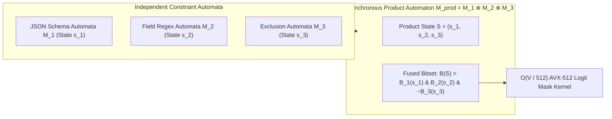

# Multi-FSM Product Automata & Synchronous Bitset Intersection

## 1. Simultaneous Multi-Constraint Satisfaction in LLM Generation
In production agent pipelines, generation is frequently subject to multiple orthogonal constraints simultaneously:
1. **Syntactic Schema:** Output must strictly adhere to a JSON schema $\mathcal{M}_{\text{schema}}$ (e.g., specific field types and required properties).
2. **Domain Regex:** A specific field (e.g. an email, ISO-8601 timestamp, or chemical SMILES formula) must match a regular expression $\mathcal{M}_{\text{domain}}$.
3. **Safety / Lexical Exclusion:** Tokens must strictly avoid toxic, sensitive, or jailbreak-triggering phrases represented by an exclusion automaton $\mathcal{M}_{\text{safe}}$.

Evaluating these constraints sequentially causes severe latency overhead and catastrophic backtracking when a valid JSON token violates an internal domain regex. **Product Automata Decoding** solves this by pre-compiling the Cartesian product of the constituent automata into a unified state space.

## 2. Cartesian Product Transition Function & SIMD Masking
Let $\mathcal{M}_1 = (S_1, \Sigma_c, \delta_1, s_{0, 1}, F_1)$ and $\mathcal{M}_2 = (S_2, \Sigma_c, \delta_2, s_{0, 2}, F_2)$ be two deterministic finite automata over alphabet $\Sigma_c$. The synchronous product automaton is defined as:
$$\mathcal{M}_{\text{prod}} = \mathcal{M}_1 \otimes \mathcal{M}_2 = (S_1 \times S_2, \Sigma_c, \delta_{\text{prod}}, (s_{0, 1}, s_{0, 2}), F_1 \times F_2)$$
where the transition function advances both state machines synchronously:
$$\delta_{\text{prod}}((s_1, s_2), c) = (\delta_1(s_1, c), \delta_2(s_2, c))$$

For the vocabulary bitsets $\mathcal{B}_1(s_1), \mathcal{B}_2(s_2) \in \{0, 1\}^V$, the valid continuation mask for product state $(s_1, s_2)$ is computed via bitwise logical AND:
$$\mathcal{B}_{\text{prod}}(s_1, s_2) = \mathcal{B}_1(s_1) \land \mathcal{B}_2(s_2)$$

### Microsecond Hardware Execution
Using AVX-512 or CUDA Warp-level bitwise operations (`__vand`), intersecting bitsets across a $128\text{K}$ vocabulary requires only:
$$\frac{128\text{,}000 \text{ bits}}{512 \text{ bits/register}} = 250 \text{ SIMD operations} \approx 0.12 \, \mu\text{s}$$
This enables real-time synchronous enforcement of dozens of concurrent constraints at zero noticeable latency penalty ($<1\%$ decode overhead).
