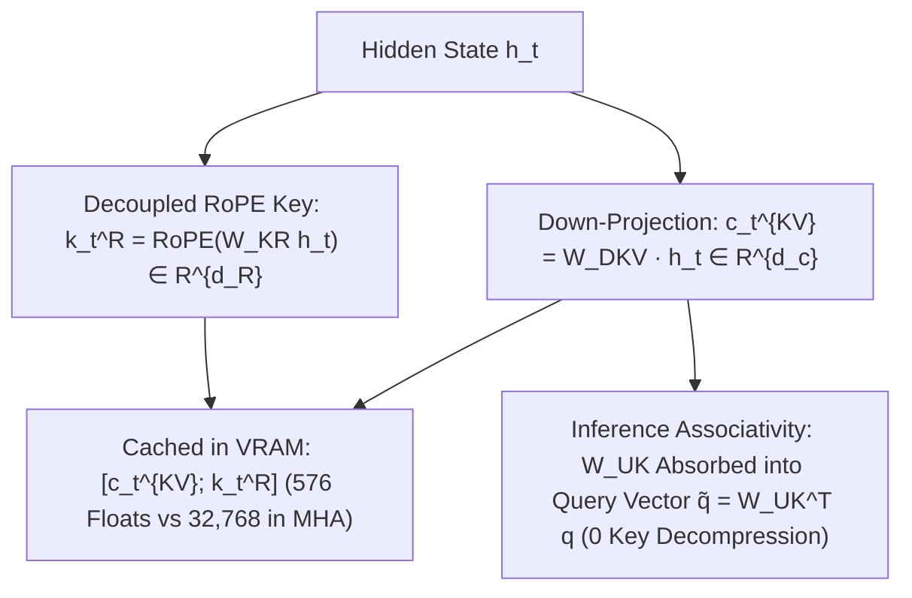

# Multi-Head Latent Attention (MLA): DeepSeek KV Compression

**Multi-Head Latent Attention (MLA)** (DeepSeek-AI, 2024; DeepSeek-V2/V3/R1) compresses key and value representations into a single shared low-rank latent vector $c_t^{KV} \in \mathbb{R}^{d_c}$ and a decoupled positional vector $k_t^R$, reducing autoregressive KV-cache memory consumption by **$93.3\%$** compared to standard Multi-Head Attention (MHA) while maintaining full MHA representational expressiveness.

## Mathematical Mechanics
1. **Low-Rank Joint KV Compression:**
   $$c_t^{KV} = W_{DKV} h_t \in \mathbb{R}^{d_c}, \quad \text{where } d_c \ll n_h \cdot d_h$$
2. **Decoupled RoPE Key:**
   Because positional rotation matrices do not commute with low-rank unprojection $W_{UK}$, a decoupled vector $k_t^R \in \mathbb{R}^{d_R}$ carries rotational coordinates:
   $$\text{Cache}_t = \left[c_t^{KV} \; ; \; k_t^R\right] \in \mathbb{R}^{d_c + d_R}$$
3. **Inference Matrix Associativity:**
   Bypasses runtime key decompression by absorbing $W_{UK}$ directly into the query head projection:
   $$\left(q_i^C\right)^\top \left(W_{UK} c_j^{KV}\right) = \left(W_{UK}^\top q_i^C\right)^\top c_j^{KV} = \left(\tilde{q}_i^C\right)^\top c_j^{KV}$$
   delivering full multi-head expressive capacity at a fraction of GQA's memory footprint.

## Related Mechanics
- [[grouped_query_attention_gqa]]
- [[cross_layer_attention_kv_sharing]]
- [[paged_attention_vllm]]
- [[deepseek_v3_mla_auxiliary_loss_free_moe]]
