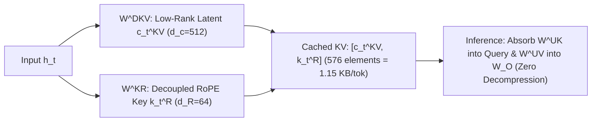

# Multi-Head Latent Attention (MLA) & Decoupled RoPE

## 1. The Core Innovation of MLA (DeepSeek-V2/V3/R1)
In large-scale autoregressive serving, Multi-Head Attention (MHA) consumes prohibitive amounts of KV cache memory ($2 \times n_h \times d_h = 32,768$ values per token per layer), while Grouped-Query Attention (GQA) degrades expressive retrieval capacity. **Multi-Head Latent Attention (MLA)** compresses the Key-Value cache into a shared **low-rank latent vector** $\mathbf{c}_t^{KV} \in \mathbb{R}^{d_c}$ ($d_c = 512$), achieving a **$56.8\times$ reduction vs MHA** and **$3.56\times$ reduction vs GQA-8** while exceeding MHA expressive accuracy.

## 2. Decoupled RoPE & Inference Weight Absorption
- **Decoupled RoPE**: Because Rotary Position Embeddings are non-commutative with low-rank projection matrices, RoPE cannot be directly absorbed if applied to compressed latents. MLA cleanly decouples positional keys ($\mathbf{k}_t^R \in \mathbb{R}^{64}$) from content latents ($\mathbf{c}_t^{KV} \in \mathbb{R}^{512}$), storing only $512 + 64 = 576$ scalars per token.
- **Inference Kernel Absorption**: During decoding, the up-projection matrices $W_i^{UK}$ and $W_i^{UV}$ are mathematically absorbed into the query vector $(\tilde{\mathbf{q}}_i = (W_i^{UK})^T \mathbf{q}_i)$ and output projection matrix $W_O$, eliminating the need to decompress multi-head keys and values in GPU memory.
