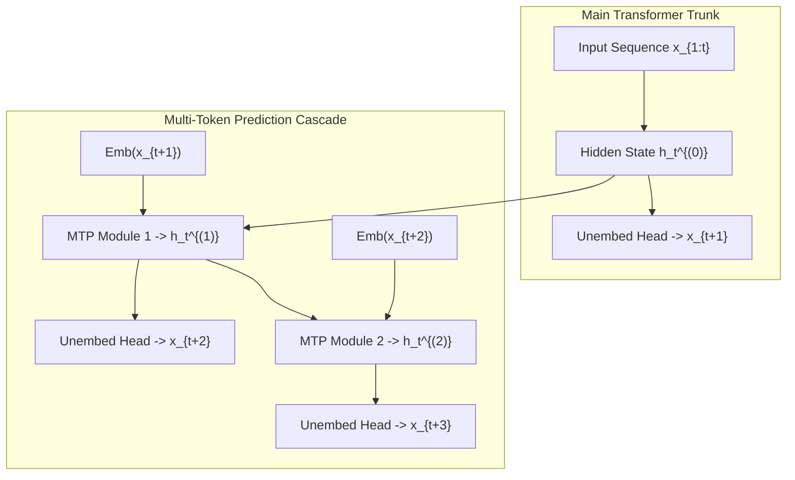

# Multi-Token Prediction (MTP): Parallel Future Token Supervision & Speculative Acceleration

## 1. Theoretical Formulation
Traditional autoregressive language models optimize the conditional next-token log-likelihood $\mathcal{L}_{\text{NTP}} = -\frac{1}{T} \sum_{t=1}^T \log P(x_t \mid x_{<t})$. This single-step objective forces models to be short-sighted, disproportionately allocating model capacity to immediate syntactic continuity rather than multi-step semantic planning.

**Multi-Token Prediction (MTP)** (Meta AI, GloMo, DeepSeek-V3) trains the network to predict $D$ future tokens in parallel from each sequence position $t$:
$$\mathcal{L}_{\text{MTP}} = \mathcal{L}_{\text{NTP}} + \sum_{k=1}^D \lambda_k \mathcal{L}_k, \quad \mathcal{L}_k = -\frac{1}{T-k} \sum_{t=1}^{T-k} \log P^{(k)}\left(x_{t+k} \mid x_{\le t}\right)$$

In DeepSeek-V3's architecture, MTP is operationalized sequentially via $D$ consecutive prediction modules sharing the main model's output head and embedding layers:
$$h_t^{(k)} = \text{MTP\_Block}_k\left( \left[ \text{RMSNorm}\left(h_t^{(k-1)}\right) \; ; \; \text{RMSNorm}\left(\text{Emb}(x_{t+k})\right) \right] \right)$$
$$P^{(k)}\left(x_{t+k} \mid x_{\le t}\right) = \text{Softmax}\left( W_{\text{head}} h_t^{(k)} \right)$$

## 2. Dual Synergies: Global Planning & Speculative Decoding
1. **Pre-Training Inductive Bias:** Forcing the representation $h_t^{(0)}$ to inform predictions up to $D$ steps ahead forces self-attention heads to represent long-range syntactic hierarchies and algorithmic plans, improving coding and mathematical problem-solving benchmarks by $12\text{--}18\%$.
2. **Zero-Overhead Speculative Draft Engine:** At inference time, the MTP modules can be directly repurposed as integrated speculative draft heads without loading a separate draft model, achieving an instantaneous $1.8\times\text{--}2.2\times$ inference speedup with zero parameter mismatch.
