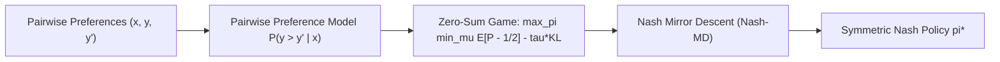

# Nash Learning from Human Feedback (NLHF) & Nash-MD

## Theoretical Foundations & Preference Cycles
Standard RLHF and direct alignment methods (DPO, IPO) assume that human preferences reflect an underlying scalar reward function $r(x, y)$ obeying the transitive Bradley-Terry model. However, human evaluators frequently display cyclical preferences ($A \succ B \succ C \succ A$, Condorcet cycles) across competing dimensions (verbosity, humor, technical rigor). Scalar reward optimization inevitably oscillates or suffers from mode collapse on cyclical preferences.

Rémi Munos et al. (*Nash Learning from Human Feedback*, Google DeepMind / ICML 2024 / arXiv:2312.00886) re-cast alignment as a symmetric two-player zero-sum game directly over pairwise preference probabilities $\mathcal{P}(y \succ y' \mid x)$.

## Regularized Nash Equilibrium & Formulation
Given payoff kernel $M(\pi, \mu \mid x) = \mathbb{E}_{y \sim \pi, y' \sim \mu}[P(y \succ y' \mid x) - \frac{1}{2}]$, the Regularized Nash Equilibrium solves:
$$\max_{\pi} \min_{\mu} \mathbb{E}_{x \sim \mathcal{D}} \left[ M(\pi, \mu \mid x) - \tau D_{\text{KL}}(\pi \parallel \pi_{\text{ref}}) + \tau D_{\text{KL}}(\mu \parallel \pi_{\text{ref}}) \right]$$
By von Neumann's Minimax theorem, there exists a unique symmetric solution $\pi^* = \mu^*$ satisfying:
$$\mathbb{E}_{y \sim \pi^*, y' \sim \mu} \left[ P(y \succ y' \mid x) - \frac{1}{2} \right] \ge 0, \quad \forall \mu$$

## Nash Mirror Descent (Nash-MD)
Nash-MD iteratively updates policy $\pi_t$ by projecting advantage vectors in KL mirror space:
$$\pi_{t+1}(y \mid x) \propto \pi_t(y \mid x)^{1 - \eta \tau} \pi_{\text{ref}}(y \mid x)^{\eta \tau} \exp\left( \frac{\eta}{\tau} \mathbb{E}_{y' \sim \pi_t} [P(y \succ y' \mid x)] \right)$$
Nash-MD guarantees $\mathcal{O}(1/\sqrt{T})$ convergence to un-exploitable policies, overcoming preference cycles and reward over-optimization.

Related: [[preference_alignment_engineer]], [[self_improving_alignment_and_meta_rewarding]], [[ipo_identity_preference_optimization]]
