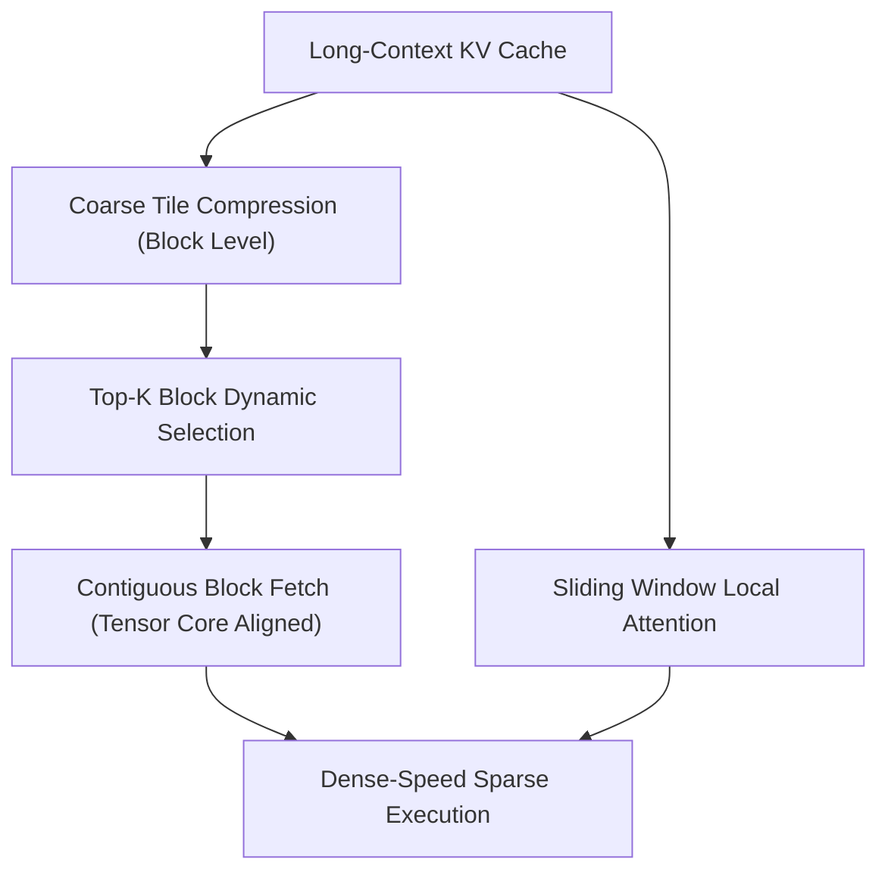

# Native Sparse Attention (NSA)

DeepSeek's Native Sparse Attention (NSA, 2025) is a hardware-aligned sparse attention mechanism engineered specifically to saturate modern GPU Tensor Cores during long-context training and inference.

## Core Mechanics
1. **Coarse-Grained Block Selection:** Tokens are grouped into hardware-aligned chunks ($64\text{--}128$ tokens). A lightweight projection computes block-level importance, dynamically selecting the top-$k$ most salient tiles.
2. **Contiguous Memory Alignment:** Unlike arbitrary unstructured token pruning that induces warp divergence and memory fragmentation, NSA guarantees memory contiguity matching warp tile sizes.
3. **Hardware Saturation:** Directly targets dense Matrix-Multiply-Accumulate (MMA) instructions on Tensor Cores, maximizing arithmetic intensity and memory bandwidth.

## Key Impacts
- Retains full long-context needle-in-a-haystack retrieval accuracy while slashing quadratic prefill and decoding latency.
- Seamlessly integrates with sliding-window local context to preserve high-resolution token representations.

Related: [[differential_transformer_noise_cancellation]], [[ring_attention_blockwise_transformers]], [[flashattention_3_hopper]], [[streaming_llm_sinks]]
