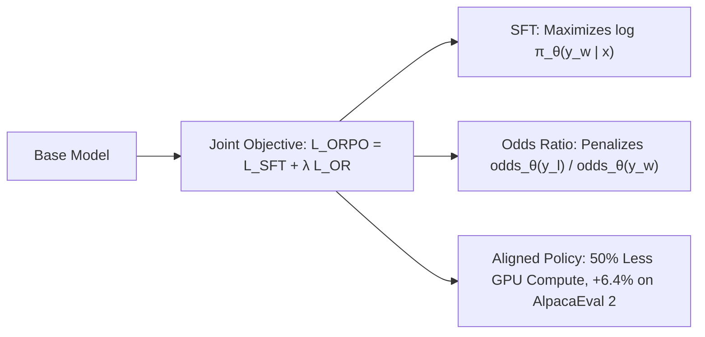

# ORPO: Odds Ratio Preference Optimization

## 1. Monolithic Single-Stage SFT & Alignment
Standard alignment pipelines require two separate phases: Supervised Fine-Tuning (SFT) followed by RLHF or DPO with a frozen reference model $\pi_{\text{ref}}$. **ORPO** (Hong et al., KAIST, EMNLP 2024) unifies instruction tuning and preference alignment into a **monolithic single-stage objective** without requiring any reference model.

## 2. Mathematical Formulation & Dynamics
The odds of generating sequence $y$ is defined as $\text{odds}_\theta(y \mid x) = \frac{\pi_\theta(y \mid x)}{1 - \pi_\theta(y \mid x)}$. ORPO maximizes the odds ratio of preferred to dispreferred completions:
$$\mathcal{L}_{\text{ORPO}}(\theta) = \mathbb{E}_{(x, y_w, y_l)} \left[ \mathcal{L}_{\text{SFT}}(x, y_w) - \lambda \log \sigma\left( \log \frac{\text{odds}_\theta(y_w \mid x)}{\text{odds}_\theta(y_l \mid x)} \right) \right]$$

- **Self-Anchored**: Cross-entropy $\mathcal{L}_{\text{SFT}}$ keeps the model anchored to high-quality generative distributions, preventing policy collapse.
- **Reference-Free**: Eliminates the frozen reference model entirely, halving post-training VRAM and cutting training runtime by $\approx 50\%$.
- **Performance**: Outperforms SFT+DPO by **$+6.4\%$** on AlpacaEval 2 while preserving instruction-following retention on MT-Bench.
