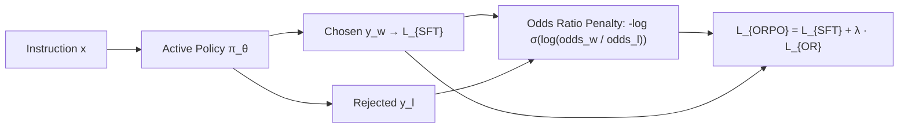

# Odds Ratio Preference Optimization (ORPO)

**Odds Ratio Preference Optimization (ORPO)** unifies supervised fine-tuning (SFT) and preference alignment into a single monolithic training phase, eliminating the frozen reference policy required by DPO.

## Mathematical Mechanics
Given the token generative odds:
$$\text{odds}_\theta(y \mid x) = \frac{P_\theta(y \mid x)}{1 - P_\theta(y \mid x)}$$
ORPO defines the log-odds ratio alignment penalty:
$$\mathcal{L}_{\text{OR}} = -\mathbb{E}_{(x, y_w, y_l)}\left[\log \sigma\left(\log \frac{\text{odds}_\theta(y_w \mid x)}{\text{odds}_\theta(y_l \mid x)}\right)\right]$$
Combining with standard negative log-likelihood on chosen tokens:
$$\mathcal{L}_{\text{ORPO}} = \mathcal{L}_{\text{SFT}}(y_w) + \lambda \mathcal{L}_{\text{OR}}$$

This reference-free formulation eliminates the memory overhead of maintaining reference model weights in GPU VRAM, achieving competitive win rates on AlpacaEval 2.0 and MT-Bench with half the training footprint.

## Related Mechanics
- [[direct_preference_optimization_dpo]]
- [[simpo_reference_free_margin_alignment]]
- [[reinforcement_learning_human_feedback]]
