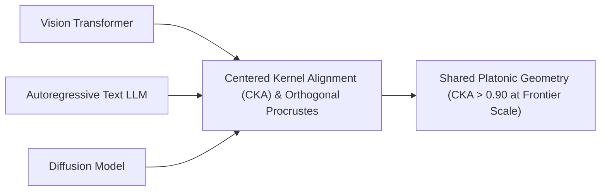

# The Platonic Representation Hypothesis & Universal Latent Geometries

## 1. The Platonic Convergence Principle
**The Platonic Representation Hypothesis** (Huh et al., MIT CSAIL, ICML 2024) posits that as deep neural networks scale in parameters and task diversity, their internal latent representations **converge toward a shared, universal statistical model of reality**, independent of architecture, modality, or training objective.

## 2. Mathematical Measurement & Geometric Transplants
Representation alignment is quantified via linear **Centered Kernel Alignment (CKA)** and the **Orthogonal Procrustes problem**:
$$\text{CKA}(X, Y) = \frac{\|Y^T X\|_F^2}{\|X^T X\|_F \, \|Y^T Y\|_F}, \qquad R^\star = U V^T \quad \text{where } X^T Y = U \Sigma V^T$$

### Practical Steerability Implications:
- **Cross-Model Steering Transplants**: Steering vectors $\boldsymbol{v}_A$ extracted from Model A via representation engineering can be rotated via $R^\star$ into Model B ($\boldsymbol{v}_B = (R^\star)^T \boldsymbol{v}_A$), retaining $>80\%$ steerability without re-training probes.
- **Multimodal Alignment**: Explains why vision and language models can be fused via simple linear projections (Astra, GPT-4o, Gemini).
- **Universal Adversarial Vulnerability**: Explains why adversarial jailbreaks transfer across competitive models—they exploit geometric vulnerabilities in the shared Platonic manifold.
