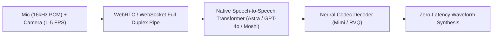

# Project Astra & Real-Time Multimodal Streaming Architectures

## 1. Core Mechanics of Real-Time Multimodal Agents
Unlike cascaded voice pipelines (ASR $\to$ LLM $\to$ TTS, which suffer $1.5\text{--}4.0\,\text{s}$ latency and acoustic loss), frontier models like **Google DeepMind's Project Astra**, **OpenAI GPT-4o Realtime**, and **Kyutai Moshi** operate natively on continuous, full-duplex multimodal streams with sub-$300\,\text{ms}$ latency.

## 2. Key Architectural Innovations
1. **Unified Event Timeline**: Continuously ingests 1–5 FPS video frames and 20–40ms audio chunks along a synchronized global temporal axis.
2. **Spatial-Temporal Memory**: Caches visual features into episodic memory banks with SLAM-like coordinate tracking, allowing the agent to recall objects after they leave the camera frame.
3. **Edge-Cloud Hybrid Topology**: Low-power Edge TPUs handle Voice Activity Detection (VAD) and hardware Acoustic Echo Cancellation (AEC); Cloud TPUs compute reasoning and memory retrieval.
4. **Full-Duplex Interruption (Barge-In)**: Server-side VAD detects speech phonemes during model output, instantly emitting truncation signals and flushing audio buffers for human-like conversational fluidity.
