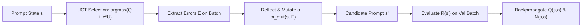

# PromptAgent: Strategic Prompt Optimization via Monte Carlo Tree Search

## Theoretical Formulation & MDP Structure
**PromptAgent** (Wang et al., ICLR 2024 / arXiv:2310.16427) replaces local greedy hill-climbing (OPRO, APE) with a strategic planning framework that models automated prompt optimization as a discrete Markov Decision Process (MDP):
$$\mathcal{M} = \langle \mathcal{S}, \mathcal{A}, \mathcal{T}, \mathcal{R} \rangle$$
- **State $s \in \mathcal{S}$:** Current natural language prompt string.
- **Action $a \in \mathcal{A}$:** Strategic prompt modification directive derived from model failure reflections.
- **Transition $\mathcal{T}(s, a) \to s'$:** Mutation LLM applying directive $a$ to prompt $s$.
- **Reward $\mathcal{R}(s)$:** Task accuracy/F1 evaluated on a validation hold-out set $\mathcal{D}_{\text{val}}$.

## Error-Reflective Action Generation & UCT Policy
Instead of unguided stochastic mutation, PromptAgent conditions mutations on concrete task failures:
1. Identify misclassified validation instances $\mathcal{E} = \{(x_k, y_k^*, \hat{y}_k) \mid \hat{y}_k \neq y_k^*\}$.
2. Generate error reflection identifying core reasoning failures: $e \sim \pi_{\text{reflect}}(\cdot \mid s, \mathcal{E})$.
3. Propose target modification directive: $a \sim \pi_{\text{action}}(\cdot \mid s, e)$.

Branch selection balances exploitation and exploration via Upper Confidence Bounds for Trees (UCT):
$$a^* = \arg\max_{a \in \mathcal{A}(s)} \left[ Q(s, a) + c_{\text{puct}} \cdot P(s, a) \cdot \frac{\sqrt{\sum_{b} N(s, b)}}{1 + N(s, a)} \right]$$
where $Q(s, a)$ is expected task reward and $N(s, a)$ is branch visit count.

## Empirical Superiority over Greedy APO
By planning multi-step search paths, PromptAgent explores temporary performance dips to unlock structural reasoning paradigms (e.g., modular decomposition, verification subroutines). On Big-Bench Hard (BBH), PromptAgent achieves **$+10\%\text{--}+15\%$** gains over base prompts, outperforming human expert-crafted prompts by $+2.3\%\text{--}+5.7\%$ and OPRO by $+4.5\%\text{--}+9.1\%$.

Related: [[prompt_architect]], [[reasoning_search_planner]], [[evolutionary_prompt_optimizer]]
