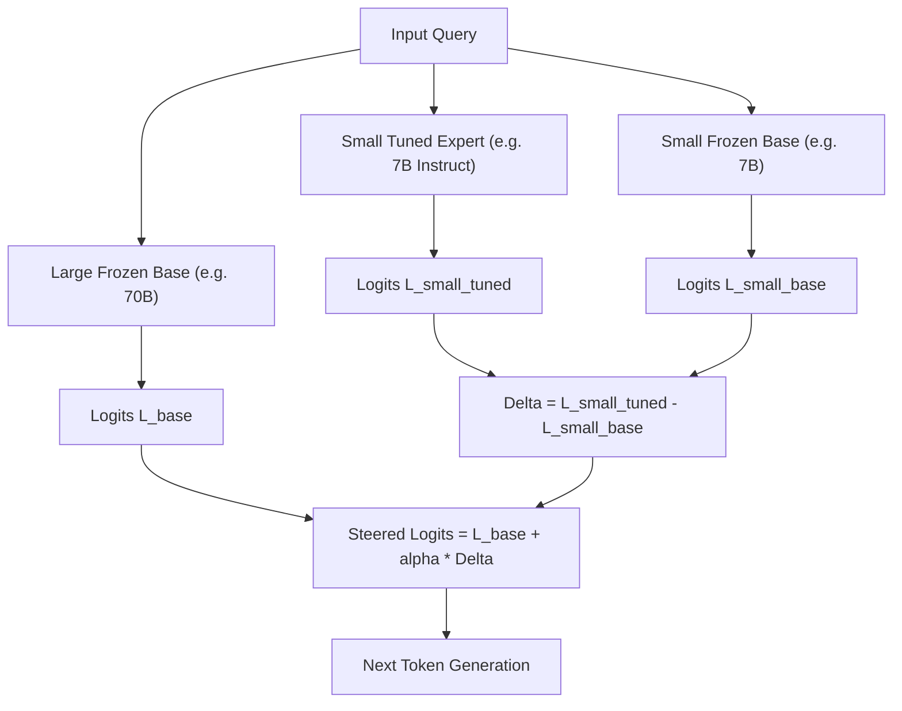

# Proxy Tuning

Proxy Tuning (Liu et al., UW 2024) is a decoding-time steering framework that transfers the capabilities of small fine-tuned models to massive frozen base models via logit arithmetic.

## Mathematical Mechanics
$$\tilde{P}(y_t \mid x, y_{<t}) \propto \exp\left(\mathcal{L}_{\text{large}}(y_t) + \alpha \cdot \left[\mathcal{L}_{\text{small, tuned}}(y_t) - \mathcal{L}_{\text{small, base}}(y_t)\right]\right)$$
1. **Logit Difference Extraction:** Subtracting base logits from tuned logits isolates the directional modification induced by instruction tuning or RLHF post-training.
2. **First-Order Scale Transfer:** Adding this difference vector to the large model's logits shifts its distribution along the alignment trajectory without computing gradients.

## Empirical Impact
- Enables black-box, proprietary, or oversized models to acquire alignment, safety guardrails, and domain expertise with zero parameter fine-tuning.
- Matches native RLHF fine-tuning performance across LLaMA-2-70B on GSM8K and AlpacaEval.

Related: [[representation_engineering_repe]], [[laser_layer_selective_rank_reduction]], [[leace_closed_form_concept_erasure]]
