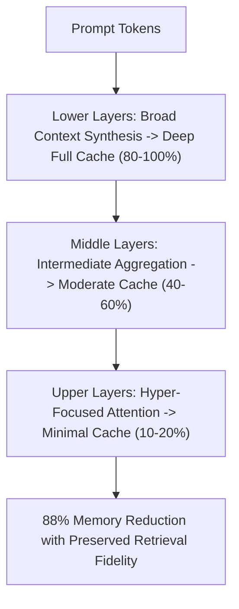

# PyramidKV: Layer-Wise KV Cache Allocation

PyramidKV (Zhang et al., 2024) implements dynamic layer-wise KV cache compression based on the pyramidal information funneling phenomenon observed across deep Transformer models.

## Core Mechanics
1. **Pyramidal Attention Funneling:** Lower layers exhibit broad, diffuse attention distributions across the entire prompt context, requiring expansive KV cache memory. In contrast, deeper layers feature hyper-concentrated attention focused narrowly on critical tokens and numerical attention sinks.
2. **Dynamic Quota Allocation:** Rather than assigning uniform memory across all layers, PyramidKV allocates large cache budgets to early layers and progressively shrinks cache allocations in deeper layers.
3. **Hardware Impact:** Reduces overall KV cache VRAM footprint by up to **$88\%$**, fully preserving reasoning and needle-in-a-haystack accuracy across extended context sequences.

Related: [[duoattention_retrieval_streaming_heads]], [[kivi_2bit_asymmetric_kv_quantization]], [[snapkv_attention_clustering]], [[mooncake_disaggregated_kv_cache_pool]]
