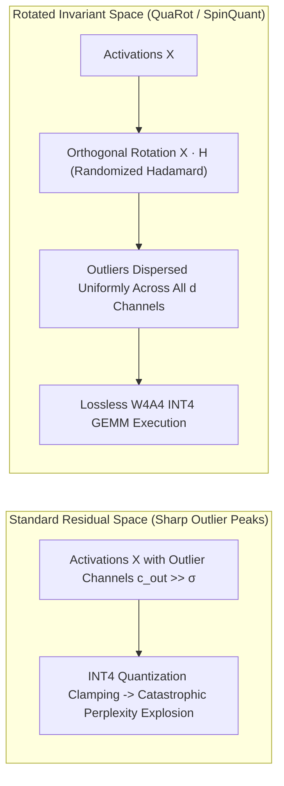

# Rotation-Based Outlier Invariance: QuaRot, SpinQuant & Randomized Hadamard Transformations

## 1. The Activation Outlier Catastrophe in Low-Bit LLM Quantization
When quantizing Transformer activations to INT8 or INT4, models suffer from catastrophic perplexity explosions due to **activation outliers**: a tiny fraction of channels ($<0.1\%$) exhibit magnitudes up to $100\times$ larger than typical hidden state values ($|X_{t, c}| > 100 \cdot \sigma_X$). Because standard tensor-wise or token-wise quantization clips or scales according to maximum values:
$$\Delta = \frac{\max |X|}{2^{b-1} - 1}$$
extreme outliers force dynamic range $\Delta$ to expand, destroying the quantization precision for $99.9\%$ of remaining normal activations.

## 2. Mathematical Mechanics of Orthogonal Rotation
**QuaRot** and **SpinQuant** eliminate activation outliers without fine-tuning by inserting orthogonal rotation matrices $Q \in \mathbb{R}^{d \times d}$ ($Q^\top Q = I$) into the computation graph:
$$Y = X W = (X Q) (Q^\top W) = \tilde{X} \tilde{W}$$
where $\tilde{X} = X Q$ represents the rotated activation and $\tilde{W} = Q^\top W$ is the rotated weight matrix (pre-computed offline).

### Randomized Walsh-Hadamard Transform (RHT)
To ensure near-zero computational overhead during runtime inference, $Q$ is instantiated as a Randomized Hadamard Matrix:
$$H_d = \frac{1}{\sqrt{2}} \begin{bmatrix} H_{d/2} & H_{d/2} \\ H_{d/2} & -H_{d/2} \end{bmatrix}, \quad Q = D \cdot H_d$$
where $D = \text{diag}(\pm 1)$ is a random diagonal sign matrix.

Under the randomized Hadamard transformation, the maximum coordinate value of any rotated vector $x \in \mathbb{R}^d$ is strictly bounded by the central limit theorem and Johnson-Lindenstrauss concentration:
$$\mathbb{E}\left[ \max_j |(x Q)_j| \right] \le \sqrt{\frac{2 \ln(2d)}{d}} \|x\|_2$$
This effectively "smears" the energy of the outlier spikes across all $d$ dimensions, eliminating distinct outlier channels and enabling true **W4A4 (4-bit Weights + 4-bit Activations + 4-bit KV Cache)** execution with negligible accuracy degradation ($<0.1$ perplexity delta).
