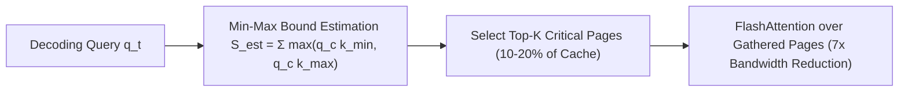

# Quest: Query-Aware Dynamic KV Cache Selection

## 1. Dynamic Sparsity vs Static Eviction
While static KV cache pruning methods (H2O, SnapKV) evict tokens based on past attention weights, token importance is inherently **query-dependent**. **Quest** (Tang et al., ICML 2024) dynamically gathers only the top-$K$ critical KV pages at each decoding step, achieving up to **$7.03\times$ speedup** in self-attention with **$>99\%$ accuracy retention**.

## 2. Min-Max Criticality Bounding
Context is divided into pages of $B=16$ tokens. During prefill, the channel-wise infimum and supremum vectors are cached:
$$\mathbf{k}_{\min, c}^{(p)} = \min_{t \in \mathcal{P}_p} \mathbf{K}_{t, c}, \quad \mathbf{k}_{\max, c}^{(p)} = \max_{t \in \mathcal{P}_p} \mathbf{K}_{t, c}$$

For any incoming query $\mathbf{q} \in \mathbb{R}^d$, the attention logit for any token $t$ in page $p$ is strictly upper-bounded by:
$$\mathbf{q} \cdot \mathbf{K}_t \le \sum_{c=1}^d \max\left( q_c \mathbf{k}_{\min, c}^{(p)}, \; q_c \mathbf{k}_{\max, c}^{(p)} \right) \triangleq S_{\text{est}}^{(p)}$$

At each generation step:
1. **Stage 1**: Load only $[\mathbf{k}_{\min}, \mathbf{k}_{\max}]$ metadata into SRAM and compute $S_{\text{est}}^{(p)}$ across all pages in parallel.
2. **Stage 2**: Transfer only the top-$K$ pages from HBM to SRAM for exact FlashAttention, reducing memory traffic by $80\text{--}90\%$.
