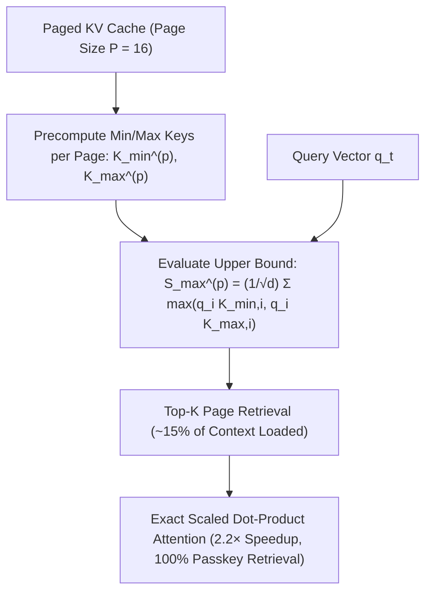

# Quest: Query-Aware KV Cache Sparsity via Logit Bounding

**Quest** (Tang et al., ICML 2024) overcomes the needle-in-a-haystack failure modes of static KV-cache eviction policies (H2O, SnapKV, StreamingLLM) by retaining the full paged KV cache in memory while dynamically retrieving only the top critical pages ($\sim 15\%$) at each decoding step using an exact mathematical logit upper bound.

## Mathematical Mechanics
1. **Coordinate-Wise Page Bounds:**
   For each page $p \in \mathcal{P}$ of size $P$:
   $$K_{\min, i}^{(p)} = \min_{j \in p} K_{j, i}, \quad K_{\max, i}^{(p)} = \max_{j \in p} K_{j, i}$$
2. **Exact Logit Upper Bound:**
   $$\max_{j \in p} \frac{q_t^\top K_j}{\sqrt{d_k}} \le S_{\max}^{(p)}(q_t) \triangleq \frac{1}{\sqrt{d_k}} \sum_{i=1}^{d_k} \max\left(q_{t, i} K_{\min, i}^{(p)}, \; q_{t, i} K_{\max, i}^{(p)}\right)$$
3. **Execution Efficiency:**
   Evaluating $S_{\max}^{(p)}$ requires only $O(d_k)$ operations per page, completely decoupling logit estimation from page size $P$. Loading only top-scoring pages cuts memory bandwidth by $85\%$ and delivers $2.23\times$ wall-clock speedup across 64k sequences with zero needle-in-a-haystack accuracy loss.

## Related Mechanics
- [[kv_cache_eviction_mechanics]]
- [[paged_attention_vllm]]
- [[snapkv_hierarchical_eviction]]
- [[duoattention_retrieval_streaming_heads]]
