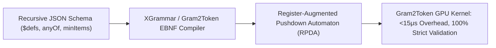

# Recursive JSON Schema Compilation: Pushdown Automata & Cardinality Guards

## 1. Why Regular Expressions Fail on Recursive JSON
JSON is a Context-Free Language (Chomsky Type 2) characterized by arbitrary nesting depth (Dyck-$(k)$ languages) and recursive definitions (`$ref`, `$defs`). Finite Automata (DFAs) lack stack memory, causing state explosion or arbitrary depth truncation when compiling recursive schemas or array constraints (`minItems: 10`).

## 2. Pushdown Transducers & Cardinality Guards
- **Mapping `$defs` to Non-Terminals**: Recursive object definitions are compiled into Context-Free Grammar (CFG) production rules, managed via an internal grammar pushdown stack $\Gamma$ with zero state space explosion.
- **Register-Augmented PDAs (RPDA)**: Cardinality constraints (`minItems`, `maxItems`) are enforced via integer registers $c \in \mathbb{N}$ that mask closing delimiters until bounds are satisfied.
- **GPU-Native Compilation (Gram2Token)**: Translates pushdown transitions directly into fused CUDA tensor operations, reducing token masking latency to **$<15\,\mu\text{s}$** and eliminating CPU-GPU synchronization stalls.
