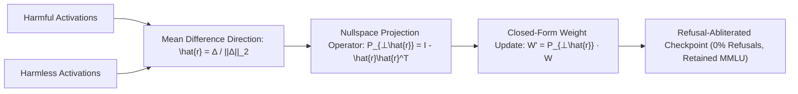

# Refusal Geometry & Closed-Form Weight Ablation

**Refusal Geometry** reveals that refusal behavior in aligned language models is mediated by a single 1-dimensional subspace direction $\hat{r} \in \mathbb{R}^{d_{\text{model}}}$ across intermediate layers. Projecting weight matrices onto the nullspace of $\hat{r}$ completely suppresses refusal without degrading general reasoning capabilities.

## Mathematical Formalism
1. **Extraction:**
   $$\hat{r} = \frac{\bar{h}_{\text{harm}} - \bar{h}_{\text{clean}}}{\|\bar{h}_{\text{harm}} - \bar{h}_{\text{clean}}\|_2}$$
2. **Causal Steering:**
   $$h_l' = h_l + \alpha \cdot \hat{r}$$
   Positive $\alpha$ induces refusal on harmless prompts; negative $\alpha$ forces compliance on harmful prompts.
3. **Weight Nullspace Projection:**
   $$W_{\text{ablated}} = \left(I - \hat{r} \hat{r}^\top\right) W$$
   Projecting attention out-projections and MLP down-projections orthogonal to $\hat{r}$ removes refusal responses with zero inference-time overhead while preserving upstream representations.

## Related Mechanics
- [[model_abliteration_refusal_geometry]]
- [[contrastive_activation_addition_caa]]
- [[representation_engineering_repe]]
- [[activation_addition_actadd]]
