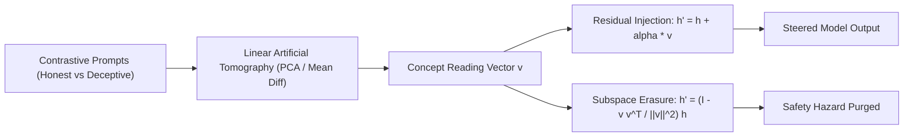

# Representation Engineering (RepE)

Representation Engineering (Zou et al., Center for AI Safety 2024) provides a top-down framework for reading and steering internal LLM cognitive representations directly within the residual stream.

## Core Mechanics
1. **Representation Reading via LAT:** Linear Artificial Tomography isolates concept directions by calculating activation differences across contrastive stimulus pairs (e.g., honest vs. deceptive completions) across intermediate transformer layers.
2. **Representation Control (Activation Steering):** Modulates model behavior at inference by adding or subtracting scaled concept vectors directly into intermediate residual activations:
   $$h' = h + \alpha \cdot v_{\text{concept}}$$
3. **Subspace Concept Erasure:** Suppresses specific capabilities or dangerous domains by projecting hidden representations onto the orthogonal complement of the concept vector, permanently disabling concept emergence.

## Benchmark Performance
- Enables fine-grained, training-free steering of truthfulness, sycophancy, and refusal behavior on TruthfulQA and safety benchmarks.

Related: [[leace_closed_form_concept_erasure]], [[laser_layer_selective_rank_reduction]], [[proxy_tuning_logit_arithmetic]]