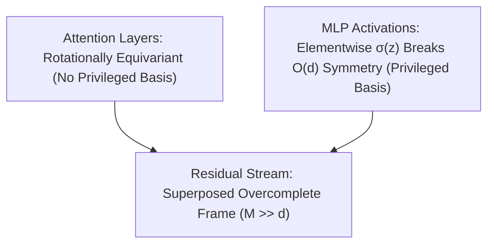

# The Privileged Basis Dilemma in Transformer Residual Streams

## 1. Rotational Invariance vs Privileged Bases
In mechanistic interpretability, a representation space has a **privileged basis** if its standard coordinate axes have distinct functional or semantic significance. 

- **Attention-Only Models**: Multi-head attention is rotationally equivariant under orthogonal transformations $Q \in O(d)$. For any orthogonal $Q$, transforming projection matrices $\tilde{W}_Q = W_Q Q^T$ and $\tilde{W}_O = Q W_O$ preserves attention logits and transforms output by $Q$. Thus, pure attention has **no privileged basis**.
- **MLP Symmetry Breaking**: Multi-Layer Perceptrons apply elementwise non-linear activations $\sigma(z)$ (GELU, SwiGLU, ReLU). Because $\sigma(Q z) \neq Q \sigma(z)$ for arbitrary orthogonal $Q$, the MLP internal hidden layer is constrained to a **strictly privileged coordinate basis**.
- **RMSNorm / LayerNorm**: While vector normalization $\|x\|_2$ is rotationally invariant, the per-channel learned scale vector $\gamma \in \mathbb{R}^d$ induces anisotropic coordinate bias, softly anchoring the residual stream.

## 2. Superposition & Sparse Autoencoders
Although MLPs break rotational symmetry, the residual stream does not assign one neuron per semantic concept. Instead, features reside in **overcomplete superposition** as non-orthogonal 1D directions $v_i \in \mathbb{S}^{d-1}$. Sparse Autoencoders (SAEs) recover these latent vectors by projecting the $d$-dimensional stream into an expanded dictionary $D \gg d$.
