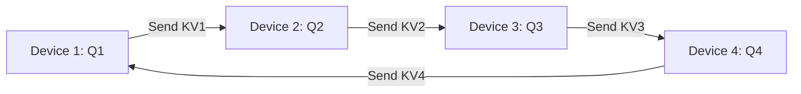

# Ring Attention with Blockwise Transformers

Ring Attention (Liu et al., UC Berkeley / ICLR 2024) breaks through the physical VRAM limits of single-GPU sequence processing by arranging distributed accelerators in a logical ring topology to compute exact self-attention.

## Core Mechanics
1. **Sequence Partitioning:** The global context sequence length $L$ is split into $N$ equal chunks of size $B = L / N$, distributed across $N$ devices.
2. **Blockwise Parallel Transformer (BPT) Overlap:** Each accelerator computes attention on its local query block $Q_i$ while concurrently transmitting its key-value block $(K, V)$ to the next peer in the ring via non-blocking peer-to-peer point-to-point communication.
3. **Communication Hiding:** Because arithmetic computation scales as $\mathcal{O}(B^2 d)$ while P2P transfer scales as $\mathcal{O}(2Bd)$, inter-device communication is 100% overlapped with attention math.
4. **Exact Attention:** Calculates exact full softmax attention without sparse approximations or low-rank projections.

## Scaling Impact
- Context length scales linearly with cluster accelerator count ($\mathcal{O}(N)$), decoupling memory limits from individual GPUs.
- Powers foundation architectures like Large World Model (LWM) processing 1M+ to 100M+ tokens across multi-node clusters.

Related: [[flashattention_3_hopper]], [[streaming_llm_sinks]], [[duoattention_retrieval_streaming_heads]], [[kv_cache_compression_survey]]
