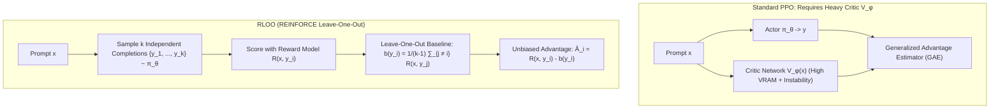

# REINFORCE Leave-One-Out (RLOO): Critic-Free Multi-Sample RL Alignment

## 1. The Bottleneck of Value Functions in PPO
Proximal Policy Optimization (PPO) has long been the standard for Reinforcement Learning from Human Feedback (RLHF). However, PPO requires maintaining four deep neural networks in GPU VRAM:
1. Policy (Actor) $\pi_\theta$
2. Value Network (Critic) $V_\phi$
3. Frozen Reference Model $\pi_{\text{ref}}$
4. Reward Model $R_\psi$

The Critic network $V_\phi$ introduces severe training instability: value estimation error drifts rapidly under policy updates, and storing $V_\phi$'s optimizer states (AdamW FP32 moments) consumes $>25\%$ of total training VRAM.

## 2. Mathematical Formulation of RLOO
**REINFORCE Leave-One-Out (RLOO)** (Ahmadian et al., NeurIPS 2024) replaces the learned value network with an empirical, multi-sample leave-one-out baseline.

For a given prompt $x$, the actor samples $k \ge 2$ independent completions:
$$\{y_1, y_2, \dots, y_k\} \sim \pi_\theta(\cdot \mid x)$$
Each completion receives a scalar reward $R_i = R(x, y_i) - \beta \, \mathbb{D}_{\text{KL}}(\pi_\theta(y_i \mid x) \parallel \pi_{\text{ref}}(y_i \mid x))$.

The baseline for completion $i$ is the empirical mean reward of the *other* $k-1$ sampled completions:
$$b(y_i) = \frac{1}{k - 1} \sum_{j \neq i} R_j$$

The policy gradient is:
$$\nabla_\theta \mathcal{J}_{\text{RLOO}}(\theta) = \frac{1}{k} \sum_{i=1}^k \nabla_\theta \log \pi_\theta(y_i \mid x) \left( R_i - \frac{1}{k - 1} \sum_{j \neq i} R_j \right)$$

### Unbiasedness & Variance Properties
Because each $y_j$ is sampled conditionally independent of $y_i$ given $x$:
$$\mathbb{E}_{y_i \sim \pi_\theta}\left[ \nabla_\theta \log \pi_\theta(y_i \mid x) \cdot b(y_i) \right] = b(y_i) \cdot \mathbb{E}\left[ \nabla_\theta \log \pi_\theta(y_i \mid x) \right] = 0$$
The baseline is strictly **unbiased**, reducing policy gradient variance by **$4\times\text{--}6\times$** compared to vanilla REINFORCE, while completely freeing the GPU memory previously occupied by the critic network $V_\phi$.
