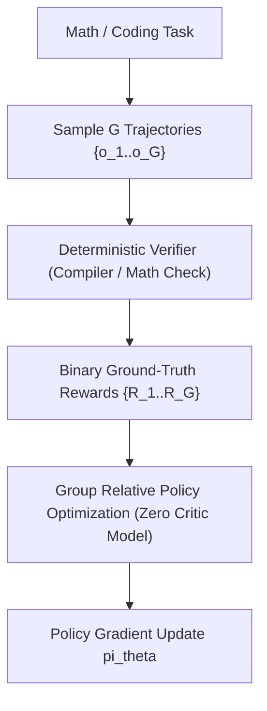

# Reinforcement Learning with Verifiable Rewards (RLVR)

DeepSeek-R1 (2025) pioneers Reinforcement Learning with Verifiable Rewards (RLVR) to bypass the vulnerability of learned reward models to reward hacking under Goodhart's Law.

## Core Mechanics
1. **Deterministic Rule-Based Verification:** Bypasses neural reward models entirely. Code tasks are verified via unit testing compilers; mathematical queries are verified via ground-truth exact matching; format adherence is verified via strict token/regex parsing.
2. **Group Relative Policy Optimization (GRPO):** Computes advantage by normalizing rewards across $G$ candidate trajectories per prompt:
   $$A_i = \frac{R_i - \text{mean}(R)}{\text{std}(R)}$$
   This completely removes the memory-heavy value critic model required by standard PPO.
3. **Emergence of Cognitive Backtracking:** Pure reinforcement learning on verifiable rewards provably sparks the autonomous emergence of chain-of-thought, self-correction, and reflective deliberation ("aha moments") without human step-by-step supervision.

Related: [[math_shepherd_step_level_supervision]], [[s1_budget_forcing_test_time]], [[self_consistency_majority_voting]], [[quiet_star_internal_rationales]]
