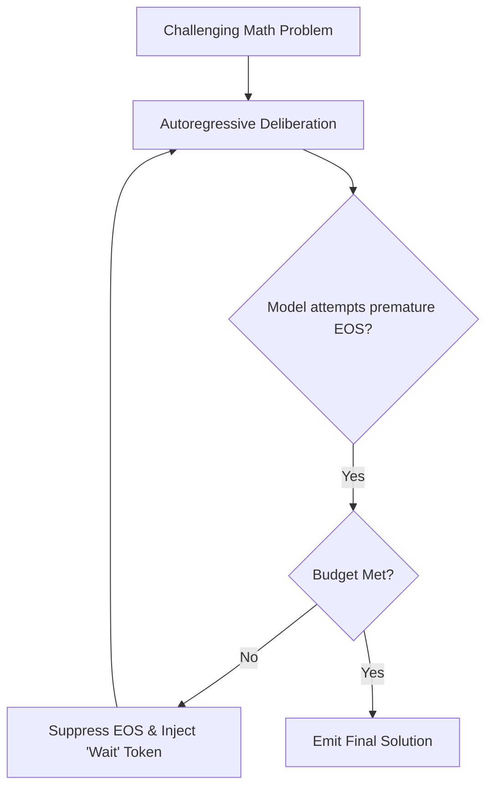

# s1 Simple Test-Time Scaling

s1 (Muennighoff et al., 2025) demonstrates that test-time reasoning scaling can be democratized using minimal supervised demonstrations and programmatic budget forcing without reinforcement learning.

## Core Mechanics
1. **Curated Demonstration Dataset (s1K):** Employs just $1,000$ high-difficulty, diverse reasoning trajectories to fine-tune open base models (such as Qwen2.5-32B).
2. **Budget Forcing via Delimiter Suppression:** When the model attempts premature termination before exhausting an allocated compute budget, the end-of-thought delimiter is suppressed and the token `"Wait"` is injected into the context.
3. **Triggered Deliberation:** Forcing the sequence length compels the model to re-evaluate prior steps, search for calculation errors, and execute recursive self-correction.

## Key Impacts
- Raises AIME 2024 competition score from $50\%$ to **$57\%$** with zero RLHF / PPO infrastructure.
- Proves test-time compute can be dynamically scaled via simple generation-time token budget control.

Related: [[rlvr_verifiable_rewards_grpo]], [[math_shepherd_step_level_supervision]], [[self_consistency_majority_voting]], [[quiet_star_internal_rationales]]
