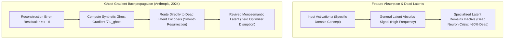

# SAE Feature Absorption & Ghost Gradients: Overcoming the Dead Latent Crisis

## 1. Feature Absorption in Sparse Dictionary Learning
In Sparse Autoencoder (SAE) training, **Feature Absorption** describes a systemic pathology where a coarse, high-frequency "general" latent absorbs the activation signal of distinct, low-frequency specific sub-features. 

Because standard SAE training optimizes an $L_1$-penalized objective:
$$\mathcal{L}_{\text{SAE}} = \|x - \hat{x}\|_2^2 + \lambda \sum_{i=1}^M |z_i|$$
activating two separate latents (e.g. a general *medical term* feature and a specific *cardiovascular surgery* feature) incurs an additive $L_1$ penalty $|z_{\text{gen}}| + |z_{\text{spec}}|$. If the reduction in reconstruction error $\Delta \|x - \hat{x}\|_2^2$ is smaller than $\lambda |z_{\text{spec}}|$, the optimizer prefers to absorb the specific concept into the general feature, leaving the specialized latent permanently inactive and uninitialized ("dead").

## 2. Mathematical Mechanics of Ghost Gradients
To eliminate dead latents without disruptive heuristic "neuron resampling" (which resets Adam moment buffers and causes training loss spikes), **Ghost Gradients** (Anthropic, 2024) dynamically route a scaled fraction of the reconstruction error through dormant latents.

1. **Dead Latent Indicator:**
   A latent $i \in \{1, \dots, M\}$ is marked dead if its activation frequency across the last $N_{\text{window}}$ tokens falls below threshold $\tau$ (e.g., zero activations over $10^7$ tokens):
   $$\mathcal{I}_{\text{dead}}(i) = \mathbb{I}\left( \sum_{t=1}^{N_{\text{window}}} \mathbb{I}(z_{t, i} > 0) = 0 \right)$$
2. **Ghost Loss Formulation:**
   For dead latents, instead of computing zero gradient ($\nabla_{z_i} \mathcal{L} \equiv 0$ when $z_i = 0$), a virtual linear activation is evaluated against the current reconstruction residual $r = x - \hat{x}$:
   $$\mathcal{L}_{\text{ghost}} = \frac{1}{2} \sum_{i \in \text{Dead}} \left\| r - \tilde{z}_i W_{\text{dec}, i} \right\|_2^2$$
   where $\tilde{z}_i = \text{ReLU}\left( W_{\text{enc}, i} x + b_{\text{enc}, i} \right)$ or an attenuated linear projection.
3. **Synthetic Gradient Injection:**
   The gradient applied to the dead latent's encoder is scaled by hyperparameter $\lambda_{\text{ghost}} \ll 1$ (e.g., $\lambda_{\text{ghost}} = 0.05$):
   $$\nabla_{W_{\text{enc}, i}} \mathcal{L} = \lambda_{\text{ghost}} \cdot \left( W_{\text{dec}, i}^\top r \right) x^\top$$

### Empirical Impact
Ghost gradients smoothly orient dead latents toward the uncaptured variance of the residual stream:
- Reduces dead latent fraction from **$>35\%$ to $<0.8\%$** at high expansion factors ($E = 128\times$).
- Prevents feature absorption, yielding **$2.8\times$ higher feature split resolution** on fine-grained concepts.
