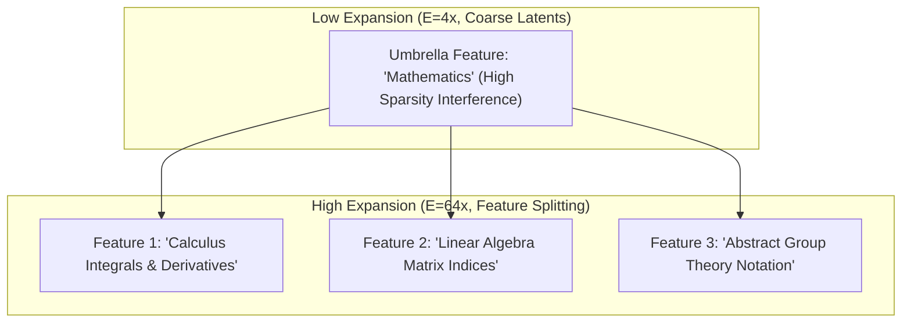

# Sparse Autoencoder Feature Splitting & Dictionary Capacity Bounds

## 1. Mathematical Mechanics of Superposition & Dictionary Expansion
Under the **Superposition Hypothesis**, a neural network represents $N \gg d$ nearly orthogonal semantic features within a $d$-dimensional activation space by exploiting the geometry of high-dimensional spheres, where the maximum number of almost-orthogonal vectors scales exponentially with dimension $d$ under the Johnson-Lindenstrauss lemma ($\langle f_i, f_j \rangle \le \epsilon = O(1/\sqrt{d})$).

When training a Sparse Autoencoder (SAE) with dictionary size $M = E \cdot d$ (where $E$ is the expansion factor, typically $8\times$ to $128\times$), increasing $M$ induces **Feature Splitting**:
- At low expansion factors ($E=4\times$), the SAE dictionary learns a coarse, polysemantic or umbrella feature vector $w_{\text{umbrella}} \in \mathbb{R}^d$ that activates on a broad conceptual class (e.g. "mathematical equations").
- At high expansion factors ($E=64\times$ or $256\times$), this single direction splits into a cluster of finer, monosemantic sub-features $\{w_1, w_2, \dots, w_k\}$ spanning specific conceptual sub-domains (e.g., "modular arithmetic notation", "differential calculus derivatives", "matrix indexing").

## 2. Power-Law Scaling & Dictionary Capacity Bounds
Empirical reconstruction loss follows strict power-law scaling with respect to dictionary size $M$ and $L_0$ sparsity (active latents per token):
$$\mathcal{L}_{\text{MSE}}(M, L_0) \propto M^{-\alpha_M} \cdot L_0^{-\alpha_L}$$
where $\alpha_M \approx 0.15\text{--}0.22$ and $\alpha_L \approx 0.35\text{--}0.45$.

**Dictionary Capacity Limit & Dead Latents:**
Beyond a critical expansion factor ($E \approx 128\times$), standard $L_1$-penalized SAEs encounter shrinkage bias and the "dead neuron" crisis where $>40\%$ of dictionary features never activate. Modern architectures mitigate this via:
1. **TopK SAEs:** Enforcing exact $L_0$ sparsity by selecting the top-$k$ activations and removing $L_1$ penalties completely.
2. **JumpReLU SAEs:** Applying a discontinuous threshold $\text{JumpReLU}(z; \theta, \epsilon) = z \cdot \mathbb{I}(z > \theta)$ to eliminate shrinkage bias while preserving clean convex boundaries.
