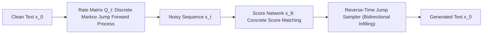

# SEDD: Score Entropy Discrete Diffusion for Language Modeling

**Score Entropy Discrete Diffusion (SEDD)** formulates natural language generation as a continuous-time Markov jump process over discrete vocabulary tokens, overcoming the sequential limitations of autoregressive transformers through bidirectional infilling.

## Mathematical Formalism
Let $Q_t \in \mathbb{R}^{V \times V}$ denote the generator matrix of the discrete jump process. The transition rate to noise is governed by:
$$\frac{d}{dt} P(x_t = j \mid x_0) = \sum_k P(x_t = k \mid x_0) Q_t(k, j)$$
SEDD optimizes a neural score network $s_\theta(x_t, t)$ via Concrete Score Matching, estimating probability transition ratios directly:
$$\mathcal{L}_{\text{score}}(\theta) = \mathbb{E}_{t, x_0, x_t}\left[\sum_{j \neq x_t} \left(s_\theta(x_t, t)_j - \frac{(Q_t)_{x_t, j} p_{t \mid 0}(j \mid x_0)}{p_{t \mid 0}(x_t \mid x_0)}\right)^2\right]$$

By abandoning causal lower-triangular attention masks, SEDD models bidirectional token contexts natively, matching autoregressive GPT-2 perplexity while unlocking arbitrary non-autoregressive infilling and editing.

## Related Mechanics
- [[non_autoregressive_generation]]
- [[score_based_generative_models]]
- [[bidirectional_infilling_architectures]]
