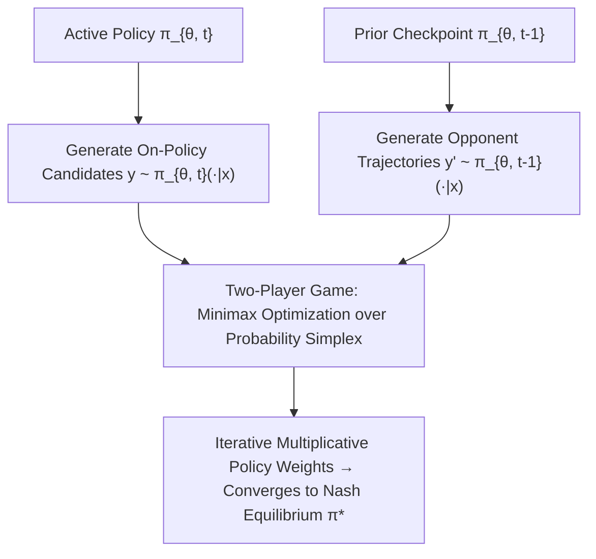

# Self-Play Preference Optimization (SPIN & SPPO)

**Self-Play Preference Optimization (SPPO)** and **Self-Play Fine-Tuning (SPIN)** reframe post-training language model alignment as finding the minimax Nash equilibrium in a symmetric two-player game, eliminating the distribution shift and reward overoptimization problems endemic to static offline preference datasets.

## Mathematical Mechanics
1. **Minimax Nash Game Formulation:** Rather than fitting a static Bradley-Terry preference score, self-play solves:
   $$\max_{\pi_1 \in \Delta} \min_{\pi_2 \in \Delta} \mathbb{E}_{x, y_1 \sim \pi_1, y_2 \sim \pi_2}\left[P(y_1 \succ y_2 \mid x) - \frac{1}{2}\right] - \tau D_{\text{KL}}\left(\pi_1 \parallel \pi_{\text{ref}}\right) + \tau D_{\text{KL}}\left(\pi_2 \parallel \pi_{\text{ref}}\right)$$
2. **SPIN Discriminative Loss:** The model plays against its previous iteration $\pi_{\theta_{t-1}}$, learning to distinguish human SFT demonstrations $y$ from its self-generated rollouts $y'$:
   $$\mathcal{L}_{\text{SPIN}}(\theta) = \mathbb{E}_{(x, y) \sim \mathcal{D}, y' \sim \pi_{\theta_{t-1}}}\left[\ell\left(\lambda \left(\log \frac{\pi_\theta(y \mid x)}{\pi_{\theta_{t-1}}(y \mid x)} - \log \frac{\pi_\theta(y' \mid x)}{\pi_{\theta_{t-1}}(y' \mid x)}\right)\right)\right]$$
3. **Distribution Shift Elimination:** Generating negative samples on-policy prevents out-of-distribution policy drift, monotonically elevating benchmark accuracy across iterative rounds without requiring new human annotations.

## Related Mechanics
- [[direct_preference_optimization_dpo]]
- [[reinforcement_learning_human_feedback]]
- [[orpo_odds_ratio_preference_optimization]]
- [[simpo_reference_free_margin_alignment]]
