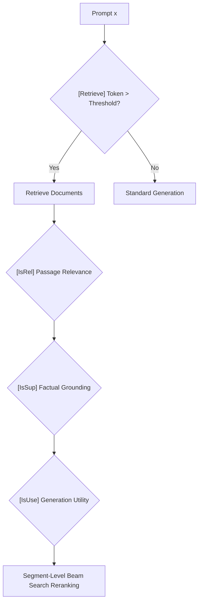

# Self-RAG: Reflective Decision Tokens & Adaptive Retrieval

**Self-RAG** trains language models to adaptively retrieve passages, critique retrieved documents, and verify output factuality through specialized reflection tokens.

## Special Token Taxonomy
Self-RAG introduces four discrete critique token sets:
- `[Retrieve]`: Predicts whether external grounding is required ($\in \{\text{yes}, \text{no}, \text{continue}\}$).
- `[IsRel]`: Evaluates retrieved passage relevance ($\in \{\text{relevant}, \text{irrelevant}\}$).
- `[IsSup]`: Verifies factual grounding in evidence ($\in \{\text{fully supported}, \text{partially supported}, \text{unsupported}\}$).
- `[IsUse]`: Evaluates overall response utility ($\in \{1, 2, 3, 4, 5\}$).

At inference time, segment-level beam search weights reflection token logits alongside standard token generation probabilities, enabling fine-grained control over retrieval frequency and factuality guarantees.

## Related Mechanics
- [[retrieval_augmented_generation_rag]]
- [[crag_corrective_retrieval_augmented_generation]]
- [[process_reward_models]]
