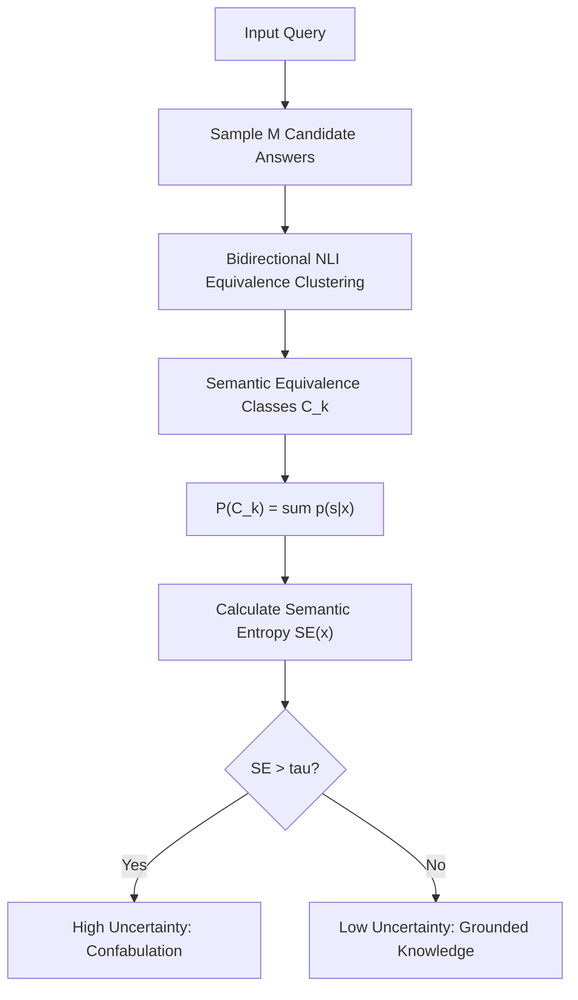

# Semantic Entropy

Semantic Entropy (Kuhn et al., Oxford / Nature 2023) quantifies epistemic uncertainty to identify hallucinations by measuring diversity over meaning clusters rather than surface token variance.

## Mathematical Mechanics
1. **Semantic Equivalence:** Generations $s, s'$ are clustered together if they bidirectionally entail each other under an auxiliary NLI cross-encoder.
2. **Marginalization:** The probability of cluster $C_k$ is the sum of sequence likelihoods:
   $$P(C_k \mid x) = \sum_{s \in C_k} p(s \mid x)$$
3. **Entropy Calculation:**
   $$\text{SE}(x) = -\sum_{k=1}^K P(C_k \mid x) \log P(C_k \mid x)$$

## Key Impacts
- Ignores trivial surface phrasing differences (e.g., active vs. passive voice) that inflate standard token perplexity.
- Outperforms verbalized confidence and raw log-likelihoods in detecting factual confabulations across medical, scientific, and trivia benchmarks.

Related: [[self_consistency_majority_voting]], [[proxy_tuning_logit_arithmetic]], [[laser_layer_selective_rank_reduction]]
