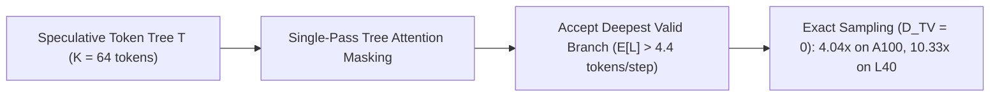

# Sequoia & SpecInfer: Tree-Structured Speculative Decoding

## 1. Beyond Linear Chains: The Tree Attention Paradigm
Standard speculative decoding uses a linear chain ($x_1 \to x_2 \to \dots \to x_K$) that discards all downstream tokens if an early token is rejected ($\alpha^K$ exponential decay). **SpecInfer** (Miao et al., ASPLOS 2024) and **Sequoia** (Chen et al., NeurIPS 2024 Spotlight) speculate a **tree of candidate tokens** $\mathcal{T}$, verifying all branching hypotheses in a single forward pass via **Tree Attention**:
$$M_{i, j} = \begin{cases} 0 & \text{if } j \in \text{Ancestors}(i) \cup \{i\} \\ -\infty & \text{otherwise} \end{cases}$$

## 2. Dynamic Programming Tree Optimization (Sequoia)
Sequoia uses dynamic programming to search for the optimal tree topology $\mathcal{T}^\star$ that maximizes expected accepted tokens under a hardware speculation budget:
$$V(d, k) = \max_{b \in \{1, \dots, k\}} \left\{ P(\text{accept } b) \cdot \left( 1 + \sum_{i=1}^b V(d - 1, k_i) \right) \right\}$$

- **Provable Distribution Invariance**: Uses multi-candidate rejection sampling to guarantee exact mathematical equivalence to the target distribution ($\mathcal{D}_{\text{TV}} = 0$).
- **Hardware-Aware Acceleration**: Delivers **$4.04\times$ speedup on A100** and up to **$10.33\times$ speedup on L40 GPUs** without modifying model weights.
