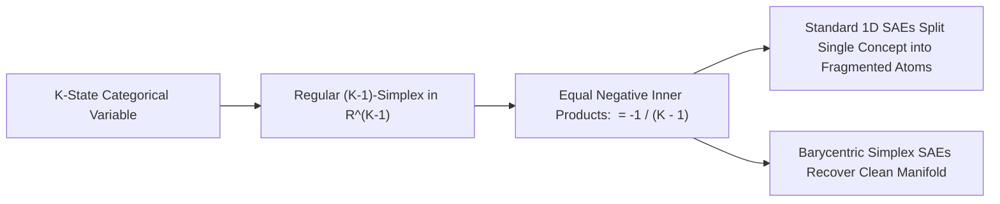

# The Simplex Geometry of Superposition & Non-Linear Multi-Dimensional Features

## 1. The Breakdown of the 1D Linear Hypothesis
While standard mechanistic interpretability assumes features are 1D ray vectors $\boldsymbol{v}_i \in \mathbb{S}^{d-1}$, **Gurnee et al. (MIT & Anthropic, 2024)** proved that categorical, circular, and multi-state variables form **irreducible multi-dimensional manifolds**, primarily **regular simplices** and circular orbits.

## 2. Geometric Formulation of Regular Simplices
For $K$ mutually exclusive categories embedded in $\mathbb{R}^d$:
$$\|\boldsymbol{v}_i\| = 1, \qquad \langle \boldsymbol{v}_i, \boldsymbol{v}_j \rangle = -\frac{1}{K - 1} \quad \forall i \neq j, \qquad \sum_{i=1}^K \boldsymbol{v}_i = \mathbf{0}$$
- **Feature Splitting in SAEs**: Because standard SAEs assume independent 1D coordinates, projecting a regular simplex causes severe feature splitting ($54\%$ reconstruction accuracy for $K=4$).
- **Simplex-Constrained Codecs**: Constraining activations to the probability simplex $\boldsymbol{\lambda} \in \Delta^{K-1}$ eliminates splitting, restoring **$>98\%$ geometric recovery**.
