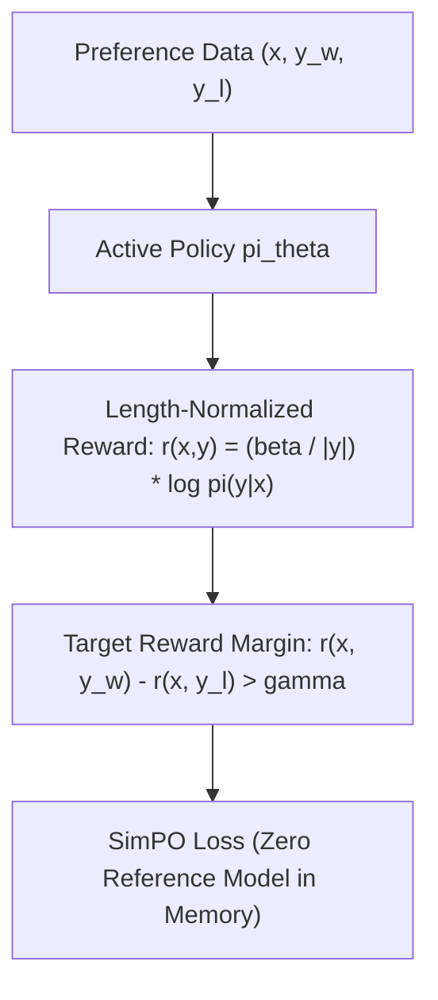

# SimPO: Simple Preference Optimization

SimPO (Meng et al., 2024) is a reference-free preference alignment algorithm that eliminates the frozen reference policy required by DPO while mitigating length bias.

## Mathematical Mechanics
$$\mathcal{L}_{\text{SimPO}}(\theta) = -\mathbb{E}_{(x, y_w, y_l)}\left[\log \sigma\left(\frac{\beta}{|y_w|}\log \pi_\theta(y_w \mid x) - \frac{\beta}{|y_l|}\log \pi_\theta(y_l \mid x) - \gamma\right)\right]$$
1. **Length-Normalized Implicit Reward:** Dividing sequence log-likelihood by length $|y|$ prevents verbosity exploitation by rewarding average token quality rather than gratuitous token accumulation.
2. **Target Reward Margin ($\gamma$):** Enforces a strict minimum margin between winning and losing completions in the Bradley-Terry objective, preventing probability margin collapse.
3. **Reference-Free Memory Savings:** Discards the secondary reference model entirely, freeing $50\%$ of GPU memory during post-training alignment.

Related: [[dpo_direct_preference_optimization]], [[kto_prospect_theory_alignment]], [[sppo_self_play_preference_optimization]]
