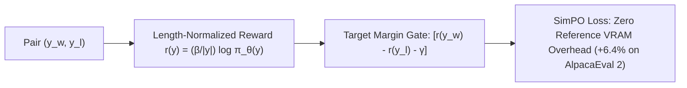

# SimPO: Simple Preference Optimization with Target Margin

## 1. The Core Innovation of SimPO
Direct Preference Optimization (DPO) requires maintaining a frozen reference model $\pi_{\text{ref}}$ in VRAM and suffers from severe **length bias exploitation**, rewarding models that generate unnecessarily verbose responses. **SimPO** (Meng et al., NeurIPS 2024) introduces a reference-free objective that aligns implicit reward directly with **length-normalized average log-likelihood**:
$$r_{\text{SimPO}}(x, y) \triangleq \frac{\beta}{|y|} \log \pi_\theta(y \mid x) = \frac{\beta}{|y|} \sum_{t=1}^{|y|} \log \pi_\theta(y_t \mid x, y_{<t})$$

## 2. Loss Objective & Target Margin
SimPO penalizes policies unless winning responses exceed losing responses by an explicit target reward margin $\gamma > 0$:
$$\mathcal{L}_{\text{SimPO}}(\theta) = -\mathbb{E}_{(x, y_w, y_l)} \left[ \log \sigma\left( \frac{\beta}{|y_w|} \log \pi_\theta(y_w \mid x) - \frac{\beta}{|y_l|} \log \pi_\theta(y_l \mid x) - \gamma \right) \right]$$

- **Eliminates Length Bias**: Normalizing by sequence length $|y|$ stops models from generating fluff to inflate cumulative log-probability.
- **50% Memory Reduction**: By dropping $\pi_{\text{ref}}$, SimPO cuts memory bandwidth and GPU VRAM footprint in half, accelerating post-training alignment by $\sim 20\%$.
