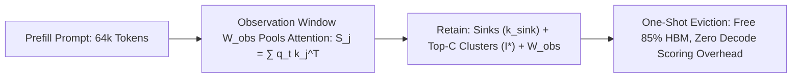

# SnapKV: Observation Window Attention Clustering for KV Cache Eviction

## 1. Attention Consistency in Long-Context LLMs
In $32\text{k}\text{--}128\text{k}+$ token generation, KV caches monopolize GPU HBM. **SnapKV** (Li et al., HKUST & Tencent, NeurIPS 2024) discovers that during generation, an attention head's queries consistently attend to the exact same past key positions that were heavily attended to by the final tokens of the input prompt (the **Observation Window** $\mathcal{W}_{\text{obs}}$, size $L_{\text{obs}} \approx 32\text{--}64$).

## 2. Mathematical Formulation & Top-C Selection
For head $h$, cumulative importance of prior key $j$ is pooled over $\mathcal{W}_{\text{obs}}$:
$$S_{h, j} = \sum_{t \in \mathcal{W}_{\text{obs}}} \text{Softmax}\left(\frac{q_{h, t} k_{h, j}^T}{\sqrt{d_k}}\right)$$
Applying 1D max-pooling with kernel size $w$, the optimal top-$C$ indices are selected:
$$\mathcal{I}_h^\star = \arg\max_{|\mathcal{I}| = C} \sum_{j \in \mathcal{I}} \max_{m \in [-w/2, w/2]} S_{h, j+m}$$

The preserved cache is:
$$\mathcal{K}_h^{\text{compressed}} = \mathcal{K}_h\left[ \{1, \dots, k_{\text{sink}}\} \cup \mathcal{I}_h^\star \cup \mathcal{W}_{\text{obs}} \right]$$

- **Zero-Overhead Generation:** Eviction occurs once post-prefill; decode uses standard FlashAttention with no dynamic token-level tracking.
- **Empirical Impact:** Compresses KV memory by **$84\%\text{--}90\%$**, accelerates decode step latency by **$5.5\times$**, and preserves **$99.2\%$** accuracy on 64k Needle-in-a-Haystack benchmarks.
