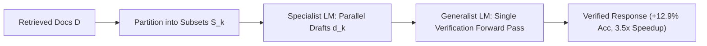

# Speculative RAG: Drafting & Verification

## The Retrieval-Augmented Latency & Attention Bottleneck
Feeding dozens of raw retrieved passages into a monolithic LLM causes context bloat, quadratic prefill latency, and attention failure modes ("lost-in-the-middle").

**Speculative RAG** (Wang et al., UCSD & Google Cloud AI Research, ICLR 2025 / arXiv:2407.08223) accelerates RAG by decoupling retrieval generation into a two-stage **Drafting-Verification** architecture.

## Architecture: Specialist Drafting vs. Generalist Verification
1. **Document Partitioning:** Retrieved passages $\mathcal{D} = \{D_1, \dots, D_M\}$ are partitioned into $K$ subsets $\mathcal{S}_1, \dots, \mathcal{S}_K$.
2. **Parallel Specialist Drafting:** A lightweight instruction-distilled Specialist LM $\mathcal{M}_{\text{spec}}$ drafts answers concurrently across subsets:
   $$d_k = \mathcal{M}_{\text{spec}}(q, \mathcal{S}_k), \quad \forall k \in \{1, \dots, K\}$$
3. **Batched Generalist Verification:** A high-capacity Generalist LM $\mathcal{M}_{\text{gen}}$ evaluates all candidate drafts in a single forward pass:
   $$y^* = \mathcal{M}_{\text{gen}}(q, \{d_1, \dots, d_K\})$$

## Empirical Benchmarks
On TriviaQA, PopQA, and PubHealth, Speculative RAG achieves:
- **Up to $+12.9\%$ accuracy gain** over standard RAG.
- **$3.5\times$ latency speedup**.
- **$51\%$ reduction in input tokens processed by the heavy generalist**.

Related: [[prompt_architect]], [[mixture_of_agents_collaborative_swarms]], [[agent_orchestration_magentic_one_and_state_machines]]
