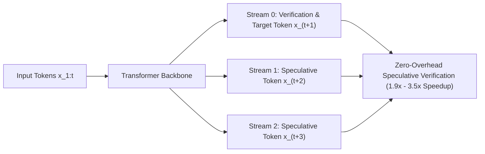

# Speculative Streaming & Multi-Stream In-Model Drafting

## Auxiliary Model Elimination in Edge & Server Serving
Conventional speculative decoding requires hosting and synchronizing two models (target and draft), multiplying memory allocations and introducing runtime divergence. **Speculative Streaming** (Bhendawade et al., Apple / ACL 2024 / arXiv:2402.11131) integrates speculative drafting directly into the target model itself via multi-stream attention.

## Multi-Stream Attention Kernel
At generation position $t$, the forward pass executes simultaneously across $K+1$ streams:
- **Main Stream ($s=0$):** Verifies previous tokens and produces true token $x_{t+1}$.
- **Speculative Streams ($s \in \{1, \dots, K\}$):** Parallel auxiliary queries $\{q_t^{(1)}, \dots, q_t^{(K)}\}$ predict future tokens $\{x_{t+2}, \dots, x_{t+K+1}\}$.
- **Shared Key-Value Attention:** All speculative streams attend directly to the main stream's materialized KV cache:
  $$M_{i, j}^{(s)} = \begin{cases} 1 & \text{if } j \le i \text{ in Main Stream} \\ 1 & \text{if } j = i \text{ in Stream } s \\ 0 & \text{otherwise} \end{cases}$$
Zero additional KV cache memory is allocated.

## Multi-Token Loss & Benchmarks
The model is fine-tuned with a joint loss $\mathcal{L} = \mathcal{L}_{\text{main}} + \sum \lambda_k \mathcal{L}_{\text{spec}}^{(k)}$. Speculative Streaming achieves **$1.9\times\text{--}3.5\times$ speedups** on Apple Silicon, edge devices, and cloud GPUs, matching auxiliary-model speculative performance with zero extra runtime footprint.

Related: [[speculative_decoding_specialist]], [[medusa_speculative_tree_attention]], [[lookahead_decoding_jacobi_iteration]]
