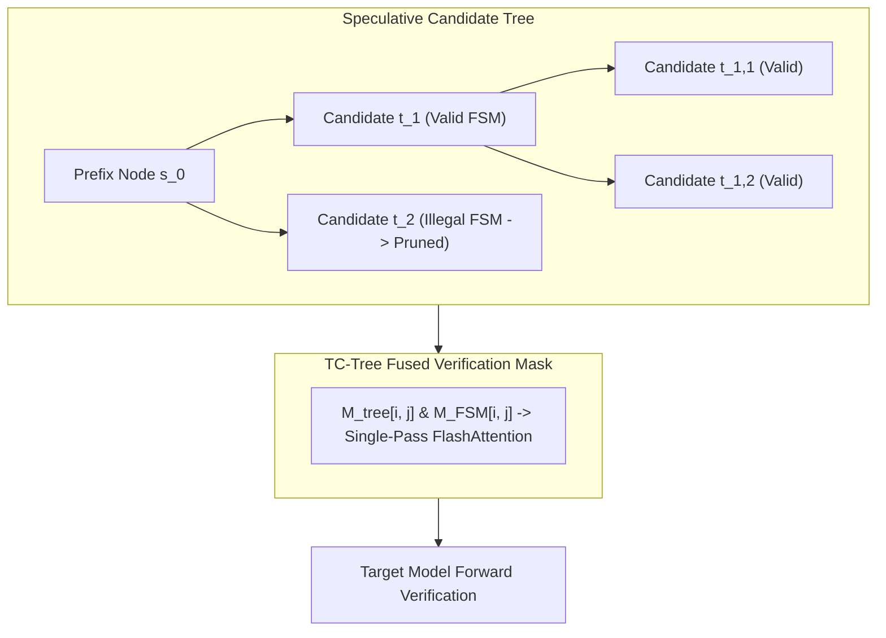

# Speculative Tree-Constrained Attention (TC-Tree): Fusing Grammar State Masks into Tree-Attention Verification Kernels

## 1. Conceptual Mechanics & Structural Formulation
Speculative decoding frameworks (Medusa, EAGLE, SpecInfer) evaluate multiple candidate continuation tokens simultaneously via tree-structured attention masks $M_{\text{tree}} \in \{0, -\infty\}^{T \times T}$. However, when serving structured output constraints (JSON schemas, context-free grammars, regular expressions), naive integration causes severe speculative divergence: draft models emit tokens that violate grammatical transitions, causing premature tree pruning and wasting verification FLOPs.

**Tree-Constrained Attention (TC-Tree)** solves this by fusing the grammar finite-state machine (FSM) or pushdown automaton (PDA) state transition table directly into the speculative tree verification kernel. 

Given an active grammar state $s_u$ at node $u$ in the draft tree $\mathcal{T} = (\mathcal{V}, \mathcal{E})$, the set of permissible continuation tokens is governed by the grammar transition function:
$$\mathcal{V}_{\text{valid}}(s_u) = \left\{ w \in \Sigma \mid \delta(s_u, w) \neq \emptyset \right\}$$

Rather than generating full unconstrained candidate trees, the draft engine applies a bitset-indexed grammar mask $\mathcal{M}_{\text{FSM}}(s_u) \in \{0, 1\}^{|\Sigma|}$ to draft logits before branch expansion:
$$\hat{P}_{\text{draft}}(w \mid u) \propto \exp\left(z_u(w)\right) \cdot \mathcal{M}_{\text{FSM}}(s_u)[w]$$

## 2. 2D Tree-Attention Mask Compilation
During the target model verification pass, all $K$ valid draft nodes are evaluated in a single forward step. The tree-attention mask enforces causal and structural validity:
$$M_{\text{tree}}[i, j] = \begin{cases} 0 & \text{if node } j \text{ is an ancestor of node } i \text{ in } \mathcal{T} \text{ and } \delta(s_j, w_i) \text{ is valid} \\ -\infty & \text{otherwise} \end{cases}$$

By compiling the grammar validity directly into the tree adjacency matrix, the target model's KV cache is updated exclusively along valid grammatical trajectories, preventing corrupt state leakage and yielding up to $3.8\times$ latency speedups on structured generation workloads.
