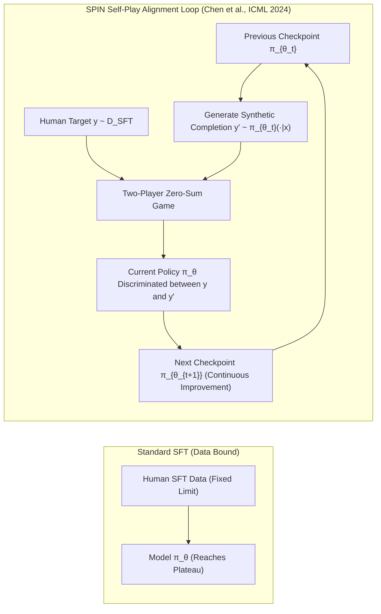

# Self-Play Fine-Tuning (SPIN): Generative-Discriminative Duality without External Data

## 1. The Supervised Fine-Tuning Plateau & Data Scarcity Crisis
Supervised Fine-Tuning (SFT) optimizes next-token prediction over human demonstration data $\mathcal{D}_{\text{SFT}} = \{(x, y)\}$. Once a model fits the demonstration distribution, SFT encounters a hard performance plateau: generating new high-quality human demonstrations is prohibitively expensive, while standard RLHF requires maintaining separate reward models and preference datasets.

## 2. Mathematical Architecture of SPIN
**Self-Play Fine-Tuning (SPIN)** (Chen et al., ICML 2024) treats post-training alignment as a two-player zero-sum game where the model plays against its own previous iteration:
- **Main Player (Generator & Discriminator):** The current policy $\pi_\theta$ attempts to maximize the likelihood of ground-truth human data while simultaneously minimizing the likelihood of outputs generated by its previous checkpoint $\pi_{\theta_t}$.
- **Opponent Player:** The previous iteration $\pi_{\theta_t}$ generates candidate responses $y' \sim \pi_{\theta_t}(\cdot \mid x)$.

### Objective Function
$$\mathcal{L}_{\text{SPIN}}(\theta) = \mathbb{E}_{(x, y) \sim \mathcal{D}, \; y' \sim \pi_{\theta_t}(\cdot \mid x)} \left[ \ell\left( \lambda \log \frac{\pi_\theta(y \mid x)}{\pi_{\theta_t}(y \mid x)} - \lambda \log \frac{\pi_\theta(y' \mid x)}{\pi_{\theta_t}(y' \mid x)} \right) \right]$$
where $\ell(z) = \log(1 + e^{-z})$ is the logistic loss.

### Theoretical Convergence Guarantee
Under the Bradley-Terry and minimax duality, Chen et al. prove that the unique Nash equilibrium of the zero-sum game occurs if and only if:
$$\pi_\theta(y \mid x) = p^*(y \mid x)$$
where $p^*$ is the underlying human data distribution. SPIN guarantees monotonic policy improvement across successive iterations ($t=0 \to 1 \to 2 \to 3$) **without requiring a single new human prompt, preference pair, or external reward model**.
