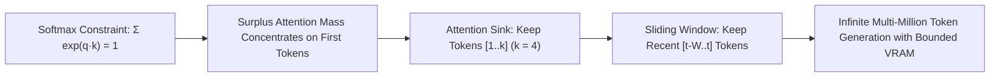

# Attention Sinks & StreamingLLM

**StreamingLLM** resolves the catastrophic perplexity collapse observed when naively truncating KV-cache buffers during long-sequence generation by preserving early "attention sink" tokens.

## Mathematical Mechanics
Due to the softmax normalization constraint $\sum_j \exp(q_i^\top k_j / \sqrt{d}) = 1$, autoregressive attention heads dump excess attention probability mass onto the initial $k$ sequence tokens ($k \approx 4$) regardless of semantic relevance. Evicting these tokens causes immediate numerical instability and perplexity explosion.

StreamingLLM implements a dual-region KV eviction buffer:
$$\mathcal{M}_t = \{1, \dots, k\} \cup \{t - W + 1, \dots, t\}$$
By permanently caching the initial $k$ tokens and rolling the remaining cache as a sliding window of width $W$, StreamingLLM delivers flat, bounded-memory inference across sequences exceeding 4,000,000 tokens across LLaMA-2, Falcon, and Mistral models.

## Related Mechanics
- [[kv_cache_eviction_mechanics]]
- [[flash_attention_mechanics]]
- [[paged_attention_vllm]]
