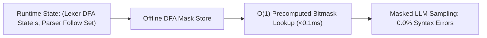

# SynCode: Offline DFA Mask Stores & Subword-Terminal Mismatch Resolution

## 1. The Subword vs Terminal Dilemma
Compilers parse **lexical terminals** (`KEYWORD`, `IDENTIFIER`, `NUMBER`), while LLMs generate **BPE subwords** that frequently cross terminal boundaries (e.g. `" = 0;"`) or represent partial terminal prefixes (`"de"`). Standard grammar engines either fail to parse partial subwords or incur heavy runtime parsing latency ($>20\,\text{ms}$/token).

## 2. Dual Automata & Offline Mask Stores
**SynCode** (Ugare et al., UIUC, TMLR 2025) couples an incremental LALR(1) parser with a Lexer DFA:
- **Offline Subword Trajectory Precomputation**: For each subword $v \in \mathcal{V}$ and every lexer DFA state $s$, SynCode precomputes the sequence of completed terminals and residual states.
- **DFA Mask Store**: Compiles a static lookup table mapping `(lexer_state, parser_follow_set) -> bitmask`. At runtime, vocabulary logit masking executes in a single hash table lookup ($<0.1\,\text{ms}$).
- **Benchmark Performance**: Reduces syntax error rates to **strictly $0.0\%$** on Python (HumanEval), Go, and SQL (Spider), increasing HumanEval Pass@1 by **$+6.4\%$** on Llama-3-8B with zero runtime parsing stalls.
