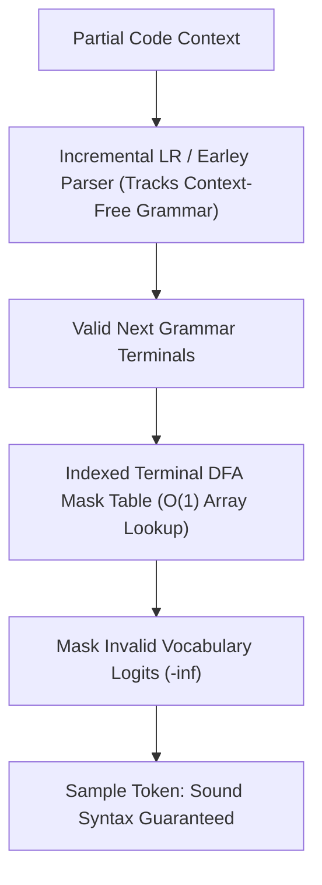

# SynCode: Grammar-Guided Code Decoding

SynCode (Ugare et al., 2024) guarantees 100% syntactically sound code synthesis by coupling incremental LR/Earley parsers with precomputed token DFA lookup tables.

## Core Mechanics
1. **Incremental Parser State Machines:** Employs incremental LR or Earley parsing to track syntactic derivations step-by-step, determining valid terminal continuations without reparsing the entire code context.
2. **Terminal DFA Mask Store:** Resolves the impedance mismatch between subword token boundaries and formal grammar terminals by compiling terminals into Deterministic Finite Automata (DFAs) precomputed into an $\mathcal{O}(1)$ lookup table.
3. **Provable Soundness:** Completely eliminates syntax errors, unclosed brackets, and indentation defects across Python, Go, and C with negligible runtime latency overhead.

Related: [[domino_grammar_speculative_decoding]], [[outlines_dfa_constrained_decoding]], [[swe_agent_aci_architecture]]
