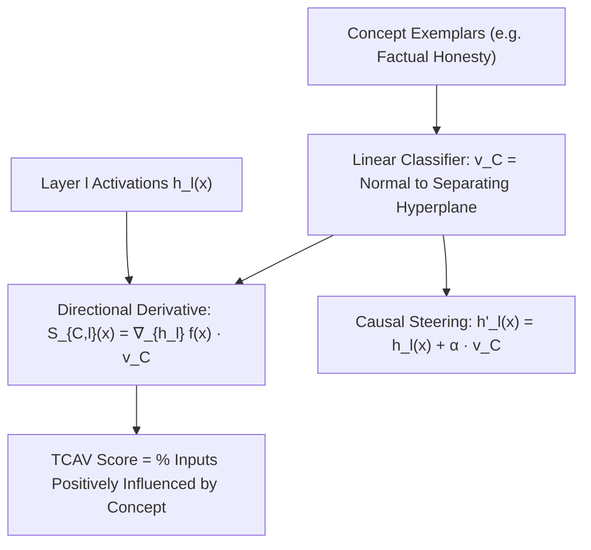

# Testing with Concept Activation Vectors (TCAV) & LAT

**Testing with Concept Activation Vectors (TCAV)** and **Linear Artificial Tomography (LAT)** quantify the causal influence of user-defined, abstract semantic concepts on model predictions using directional derivatives in internal activation spaces.

## Mathematical Mechanics
1. **Concept Activation Vector Extraction:**
   $$v_C^l \triangleq \frac{w}{\|w\|_2}, \quad \text{where } w^\top h + b = 0 \text{ separates concept examples from baseline}$$
2. **Directional Derivative Probing:**
   $$S_{C, l, k}(x) = \left\langle \nabla_{h_l} f_k(x), \; v_C^l \right\rangle$$
3. **Causal Representation Steering:**
   $$h_l'(x) = h_l(x) + \alpha \cdot v_C^l$$
   Enables continuous amplification or suppression of abstract concepts (honesty, sycophancy, toxicity) across reasoning chains with linear attribution guarantees.

## Related Mechanics
- [[representation_engineering_repe]]
- [[contrastive_activation_addition_caa]]
- [[refusal_geometry_closed_form_weight_ablation]]
