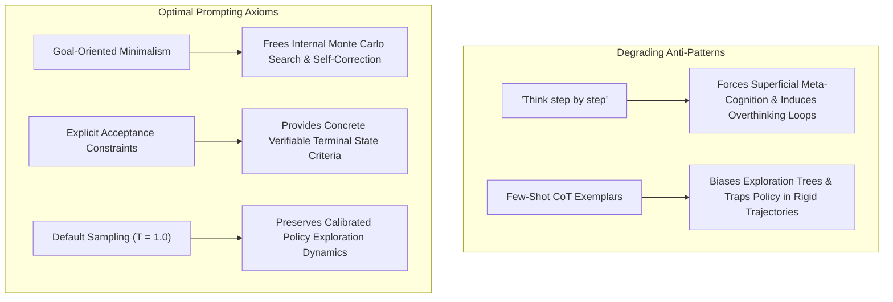

# Prompting Paradigms for Test-Time Reasoning Models (o1/o3, DeepSeek-R1)

Reasoning models trained with large-scale reinforcement learning for long thinking traces (OpenAI o1/o3, DeepSeek-R1) require fundamentally different prompt engineering strategies than standard instruction-tuned language models.

## Core Steerability Directives
1. **Prompt Minimalism Over Guidance:** Do not prescribe procedural solving steps. Provide unambiguous problem statements and concrete acceptance tests; let the reinforcement-learned policy manage search branching.
2. **Strict Sampling Rigidity:** Maintain default generation parameters ($T = 1.0$ or $0.6$, $\text{top\_p} = 1.0$). Forcing low temperatures ($T \to 0$) truncates critical branching exploration in the reasoning phase.
3. **Budget Forcing Parameters:** Control computational depth via explicit budget tokens or `reasoning_effort` directives rather than prompt verbosity.

## Related Mechanics
- [[test_time_compute_scaling]]
- [[process_reward_models]]
- [[s1_budget_forcing_test_time]]
