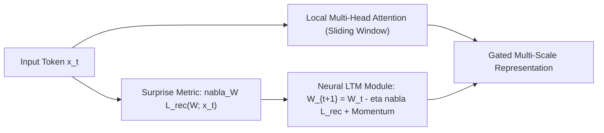

# Titans Neural Long-Term Memory

Google’s Titans architecture (Behrouz et al., 2024) introduces a neural long-term memory module that learns to memorize in real time during inference via online gradient descent.

## Core Mechanics
1. **Surprise-Driven Plasticity:** Memory weight updates are governed by surprise, measured as the gradient of an associative reconstruction loss between incoming key-value representations:
   $$\mathcal{L}_{\text{rec}} = \|M(k; W) - v\|^2$$
2. **Inference-Time Rewiring:** When tokens violate expectations, online gradient descent actively updates memory parameters:
   $$W_t = (1 - \alpha_t) W_{t-1} - \eta_t \nabla_W \mathcal{L}_{\text{rec}}(W_{t-1}) + \beta_t \Delta W_{t-1}$$
3. **Linear Context Scaling:** Decouples associative recall from explicit KV cache retention, scaling persistent context across millions of tokens with $\mathcal{O}(L)$ linear complexity.

Related: [[infini_attention_compressive_memory]], [[ring_attention_blockwise_transformers]], [[streaming_llm_sinks]], [[duoattention_retrieval_streaming_heads]]
