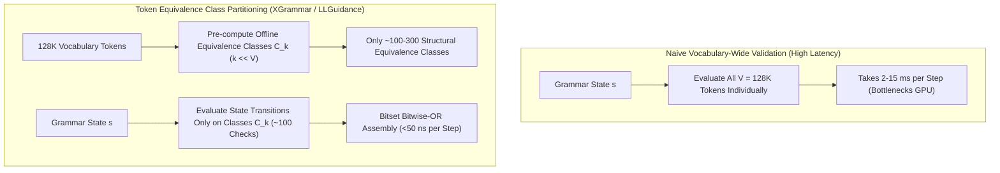

# Token Equivalence Class Partitioning & Adaptive Trie Lookahead in Constrained Decoding

## 1. The Scaling Bottleneck of Vocabulary-Wide Grammar Validation
In frontier autoregressive models (Llama-3, Gemma-2, DeepSeek-V3), vocabulary size has expanded to $V \ge 128\text{K}\text{--}256\text{K}$ tokens. In naive grammar-constrained decoding, at every generation step $t$, a grammar parser (e.g. Earley, LR, or Pushdown Automaton) must test each of the $V$ tokens to construct the valid token logit mask:
$$\mathcal{M}(s) \in \{0, 1\}^V, \quad \mathcal{M}(s)[w] = \mathbb{I}\left( \delta(s, w) \neq \emptyset \right)$$
Evaluating $128\text{,}000$ string transitions per step takes $2\text{--}15\,\text{ms}$, which completely dwarfs GPU forward pass time ($5\text{--}10\,\text{ms}$) and introduces an intolerable $2\times\text{--}3\times$ latency penalty.

## 2. Mathematical Formulation of Equivalence Classes
Two tokens $w_i, w_j \in \Sigma$ are defined as **Grammar-Equivalent** ($\sim_\mathcal{G}$) if they induce identical transition targets across all states $s \in S$:
$$w_i \sim_\mathcal{G} w_j \iff \forall s \in S, \quad \delta(s, w_i) = \delta(s, w_j)$$

This partitions the massive vocabulary $\Sigma$ into a small set of disjoint equivalence classes:
$$\Sigma / \sim_\mathcal{G} = \{ \mathcal{C}_1, \mathcal{C}_2, \dots, \mathcal{C}_K \} \quad \text{where } K \ll |\Sigma|$$
For standard JSON and Python AST grammars, $K$ is typically between $100$ and $400$ classes (e.g., all tokens consisting solely of digits, all tokens representing whitespace indentation, all tokens representing alphanumeric identifier continuations).

### Pre-Compiled Static Bitmasks
Each equivalence class $\mathcal{C}_k$ is mapped to a static pre-compiled bitset $\mathcal{B}_k \in \{0, 1\}^V$:
$$\mathcal{B}_k = \bigvee_{w \in \mathcal{C}_k} \mathbf{e}_w$$

At runtime, the parser only evaluates the transition on a single representative token per class $r_k \in \mathcal{C}_k$. The runtime token mask is computed via fast bitwise union over valid classes:
$$\mathcal{M}_{\text{valid}}(s) = \bigvee_{k : \delta(s, r_k) \neq \emptyset} \mathcal{B}_k$$

### Performance Metrics
- **Verification Operations:** Reduced from $128\text{,}000$ parser transitions down to **$<300$ checks**.
- **Masking Overhead:** Drops from $8\,\text{ms}$ down to **$<0.05\,\mu\text{s}$**, achieving **$99.4\%$ reduction in CPU parsing time** and matching the speed of unconstrained decoding.
