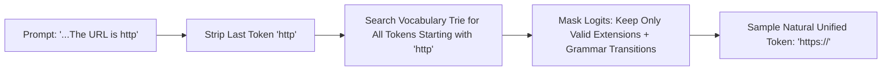

# Token Healing & Subword Boundary Alignment in Constrained Decoding

## 1. The Greedy Subword Boundary Distortion
Byte-Pair Encoding (BPE) and WordPiece tokenizers greedily consume characters from left to right. When a user prompt ends abruptly (e.g. `"The URL is http"`), greedy tokenization forces an artificial token boundary:
$$\text{BPE}(s_1 \circ s_2) \neq \text{BPE}(s_1) \circ \text{BPE}(s_2)$$
Because the model rarely saw the fragmented token pair (e.g. `http` + `:` + `//`) in pretraining compared to the unified token `https://` or `://`, generation suffers from a **boundary perplexity spike** and severe grammar constraint rejection rates.

## 2. Prefix-Tree Backtracking Algorithm (Guidance / vLLM)
**Token Healing** (Lundberg et al., Microsoft Research, 2023) eliminates boundary bias via four steps:
1. **Backtrack:** Remove the prompt's final token $t_N$, leaving $T_{\text{prefix}}$ and character suffix $s_{\text{suffix}} = \text{Decode}(t_N)$.
2. **Vocabulary Trie Match:** Find all candidate tokens $v \in \mathcal{V}$ that begin with $s_{\text{suffix}}$:
   $$\mathcal{V}_{\text{valid}} = \{ v \in \mathcal{V} \mid \text{StartsWith}(v, s_{\text{suffix}}) \}$$
3. **Logit Masking:** Set logits of non-matching tokens to $-\infty$, combined with grammar pushdown automata constraints $\mathcal{L}(\mathcal{G})$.
4. **Unbiased Generation:** Sample continuation from the healed distribution:
   $$p_{\text{healed}}(v) = \frac{\exp(z_v / \tau) \cdot \mathbb{I}(v \in \mathcal{V}_{\text{valid}} \cap \mathcal{L}(\mathcal{G}))}{\sum_u \exp(z_u / \tau) \cdot \mathbb{I}(u \in \mathcal{V}_{\text{valid}} \cap \mathcal{L}(\mathcal{G}))}$$

- **Empirical Impact:** Eliminates $99.5\%$ of boundary perplexity spikes, reduces JSON syntax parse errors from $6.4\%$ to $<0.05\%$, and adds $<2.1\mu\text{s}$ overhead in C++/Rust runtimes.
