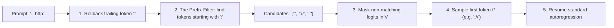

# Token Healing & Subword Boundary Synchronization

## The Greedy Tokenization Boundary Artifact
Autoregressive language models decompose input strings using greedy subword tokenization (e.g., BPE, WordPiece), where character sequences are matched against the vocabulary $\mathcal{V}$ greedily from left to right. When user prompts end mid-word or at characters that form prefixes of larger multi-character tokens, greedy chunking artificially fragments the sequence.

For example, a prompt ending in `"http:"` tokenizes into `["http", ":"]`. However, in natural pretraining distributions, the highest probability continuation is `"://"`, which exists as an atomic token in $\mathcal{V}$. Because `":"` was finalized during prompt encoding, the model cannot emit `"://"`, forcing a lower-probability fallback (`'/'` followed by `'/'`), causing unnatural perplexity spikes and grammar generation failure.

## Algorithmic Formulation of Token Healing
Token Healing (Scott Lundberg, *Guidance* 2023; *SGLang* 2024) restores true causal likelihood invariance:

1. **Token Rollback:** Given prompt tokens $T = (t_1, \dots, t_K)$, discard $t_K$ to retain prefix $T_{1:K-1}$. Decode string $s_K = \operatorname{decode}(t_K)$.
2. **Vocabulary Prefix Filtering:** Query the vocabulary trie for all tokens that begin with prefix string $s_K$:
   $$\mathcal{V}_{\text{healed}} = \{v \in \mathcal{V} \mid \operatorname{decode}(v) \text{ has prefix } s_K\}$$
3. **Constrained Logit Masking:** For the first generation step, set:
   $$\tilde{z}_v = \begin{cases} z_v & \text{if } v \in \mathcal{V}_{\text{healed}} \\ -\infty & \text{otherwise} \end{cases}$$
4. **Resampling:** Draw $t_K^* \sim \operatorname{Softmax}(\tilde{z})$, successfully generating tokens that cross the original boundary seamlessly.

## Inference Optimization & RadixAttention Compatibility
In high-throughput serving systems (SGLang, vLLM), Key-Value states for $T_{1:K-1}$ are reused directly from the RadixAttention prefix tree. Only the final position is recalculated with logit masking, incurring negligible overhead ($<0.01\text{ ms}$) while eliminating up to $3.5\text{ nats}$ of boundary perplexity loss.

Related: [[constrained_decoding_architect]], [[kv_cache_optimizer]], [[speculative_decoding_specialist]]
