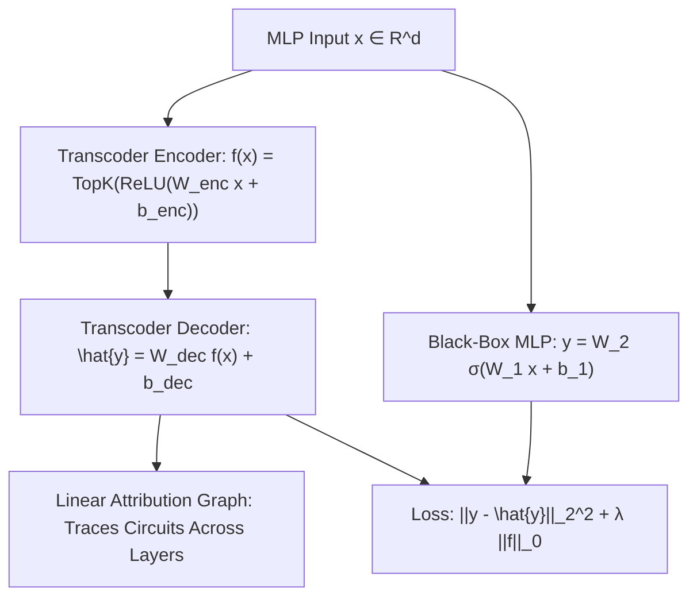

# Transcoder Networks: Replacing Non-Linear MLP Blocks with Sparse Feature Maps

**Transcoders** resolve a critical bottleneck in mechanistic interpretability: while standard Sparse Autoencoders (SAEs) reconstruct single activation layers, Transcoders learn to predict the output of an entire non-linear MLP block from its input, substituting black-box feed-forward layers with sparse, interpretable linear feature combinations.

## Mathematical Mechanics
Given input $x$ to layer $l$'s MLP and output $y = \text{MLP}(x)$, the transcoder computes:
$$f(x) = \text{TopK}\left(\text{ReLU}\left(W_{\text{enc}} x + b_{\text{enc}}\right), k\right) \in \mathbb{R}^M$$
$$\hat{y}(x) = b_{\text{dec}} + \sum_{i=1}^M f_i(x) w_i^{\text{dec}}$$
where $M \gg d_{\text{model}}$ and $k \ll M$ enforces extreme sparsity ($k \approx 32\text{--}128$).

Substituting $\text{MLP}(x)$ with $\hat{y}(x)$ collapses the transformer into an end-to-end linear computational graph. This facilitates exact inter-layer feature attribution:
$$A\left(f_i^{(l)} \to f_j^{(l+1)}\right) = \frac{\partial f_j^{(l+1)}}{\partial h_{l+1}} \cdot w_i^{\text{dec}, (l)}$$
enabling fine-grained causal intervention and behavioral steering by clamping target latent features $f_i(x)$ with minimal collateral degradation.

## Related Mechanics
- [[sparse_autoencoders_dictionary_learning]]
- [[crosscoder_cross_layer_diffing]]
- [[representation_engineering_repe]]
- [[contrastive_activation_addition_caa]]
