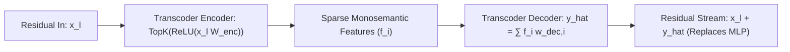

# Transcoders: Decomposing Non-Linear MLPs into Linear Feature Circuits

## 1. The Non-Linear Obstruction in Circuit Analysis
While Sparse Autoencoders (SAEs) reconstruct static activation states ($\text{SAE}(z) \approx z$), they leave the non-linear MLP block $\mathcal{F}_{\text{MLP}}(x)$ as an opaque black box. In mechanistic interpretability, this non-linear operator prevents researchers from compiling Transformers into completely linear, end-to-end computational Directed Acyclic Graphs (DAGs).

## 2. Mathematical Formulation & Circuit Linearization
**Transcoders** (Dunefsky et al., Anthropic, 2024) directly model the input-to-output mapping of the MLP sublayer:
$$\hat{y}(x) = \sum_{i \in \text{Active}(x)} f_i(x) \mathbf{w}_{\text{dec}, i} + b_{\text{dec}}, \quad f(x) = \text{TopK}\left(\text{ReLU}(x W_{\text{enc}} + b_{\text{enc}}), k\right)$$
Optimized via reconstruction loss against the true MLP output:
$$\mathcal{L} = \mathbb{E}_x \left[ \| \mathcal{F}_{\text{MLP}}(x) - \hat{y}(x) \|_2^2 + \lambda \sum_i \mathcal{S}(f_i(x)) \right]$$

- **Provable Graph Linearization:** Substituting transcoders across all layers converts the full Transformer into a strictly linear sum of attention heads and sparse feature outputs ($>94\%$ circuit completeness with $<0.06$ cross-entropy degradation).
- **Exact Path Attribution:** Replaces noisy gradient approximations with closed-form deterministic matrix multiplications from any intermediate feature directly to target logits:
  $$\text{Attribution}(f_{l, i} \to \text{Logit}_v) = f_{l, i}(x_l) \cdot \left(\mathbf{w}_{\text{dec}, l, i} \prod_{k=l+1}^L W_{\text{circuit}, k}\right) \mathbf{w}_{U, v}$$
